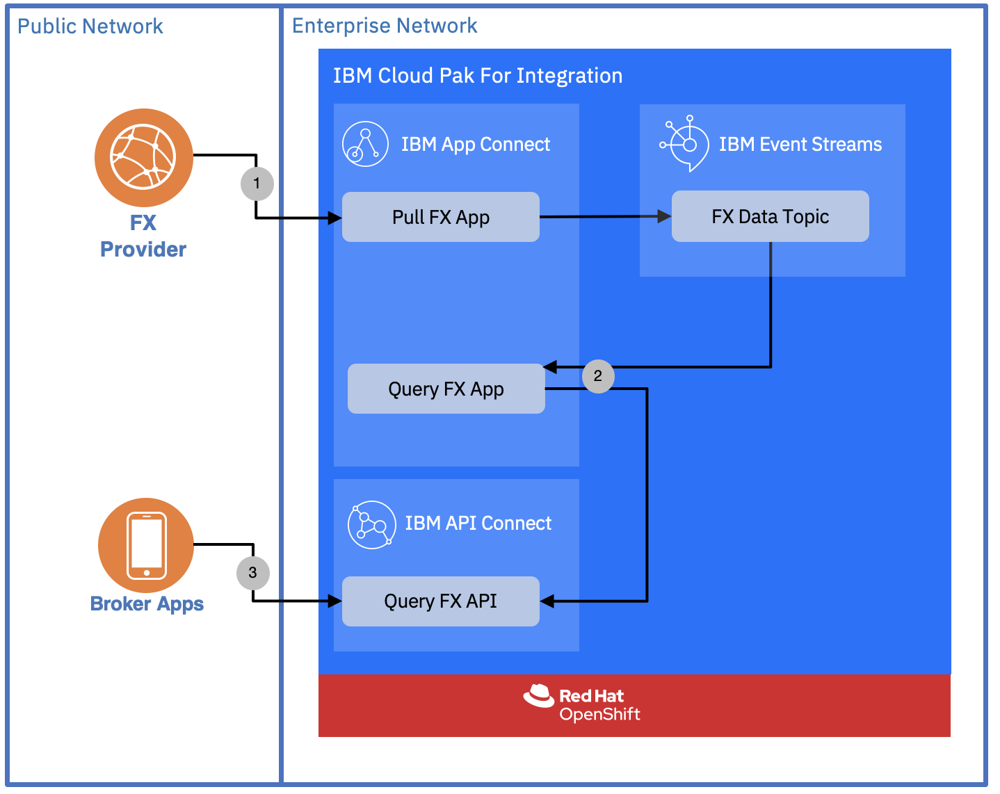

## 3. Solution Architecture
### High Level Architecture

- Assume we pull FX data from 3rd party application in XML Format and need to be transformed to the format required for the business users. We need an **Application Integration** capabilities for it
- **Event Streaming** will add resiliency to the system and to persist data for 12 month.
- **API Management** will manage and expose internal APIs to the broker apps

### Detailed Solution Flow

1. Inside **IBM App Connect Enterprise** there will be an application that pull the data periodically, transform it to the format required by the business users and publish it in an **IBM Event Streams** topic with specific currency and event life time (12 months). 
2. Second application will be created to query FX data from Topic containing FX data..
3. Query FX flow will be published by **IBM API Connect**, to be consumed by the broker apps

## 4. List of Software Products Used In Scenario

The Cloud Pak for Integration services that we will be use are:
- IBM App Connect Enterprise
- IBM Event Streams
- IBM API Connect
