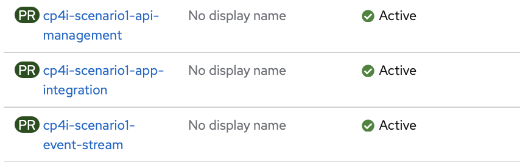
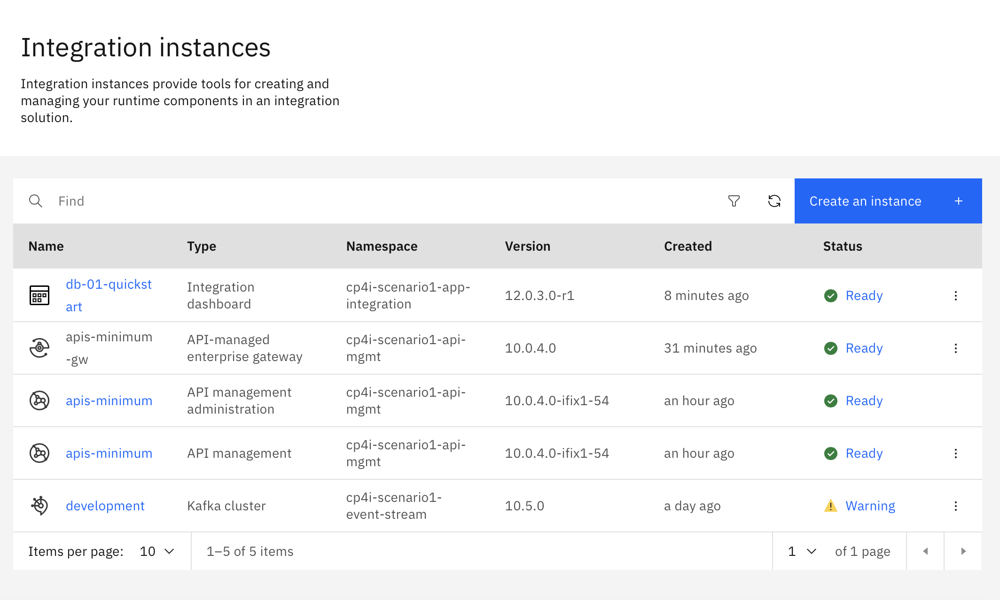
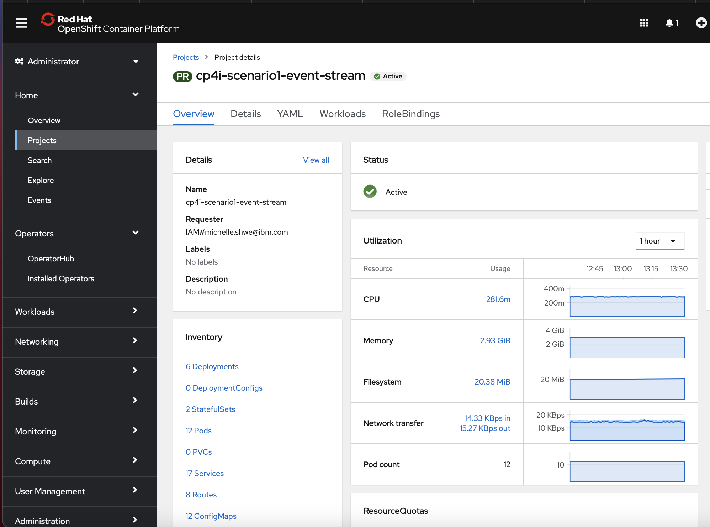
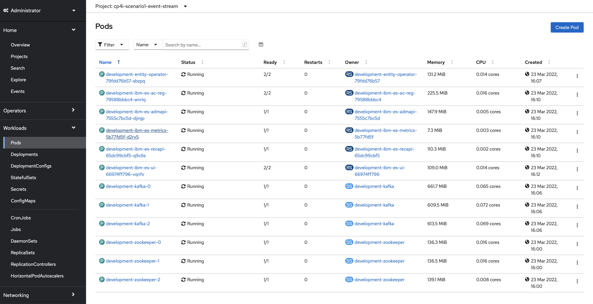
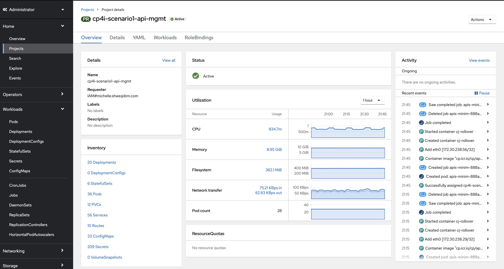
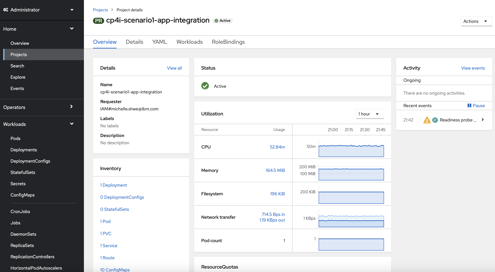
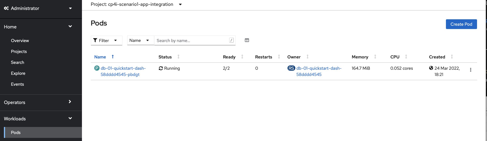

# Create Instances

Now, we will create instances corresponding to the architecture that was established in Section 2 and 3. 

The first step in doing this is to create projects corresponding to each of the instances we wish to create. 

We have created three projectes in total: `cp4i-scenario1-api-management`, `cp4i-scenario1-app-integration` and `cp4i-scenario1-event-stream`. 

Add the entitlement key that you have obtained in the previous section into each of these three projects. Follow the same steps as [here](https://github.ibm.com/ASEANZK-CP4I-Practicum/scenario1/blob/main/config/Topic5.md#515-add-entitlement-keys).  

Now, we have to use the Platform Navigator that we have installed in Section 5.1.7. Follow [this link](https://www.ibm.com/docs/en/cloud-paks/cp-integration/2021.4?topic=installing-deploying-cloud-pak-integration-using-openshift-console#deployment-using-the-openshift-web-console/logging-in) to learn how to log in to your Cloud Pak for Integration instance (IBM Cloud Pak Platform UI). One key step to follow is to get the initial Admin password - this is the only way you will be able to access the UI. 

Now that you have access to the UI, the next steps will be a breeze. You are to install the instances of [Event Stream](https://www.ibm.com/docs/en/cloud-paks/cp-integration/2021.4?topic=capabilities-event-streams-deployment), [API Management](https://www.ibm.com/docs/en/cloud-paks/cp-integration/2021.4?topic=capabilities-api-management-deployment) and [Application Integration](https://www.ibm.com/docs/en/cloud-paks/cp-integration/2021.4?topic=capabilities-application-integration-dashboard-deployment). Follow each of the links to learn how to install the respective instances. **Do note that all instances should be installed in dev (development) and not prod (production).**

### How do we check if the instances were installed correctly? 

Check the status of the instances. Once all three are installed, you will see a screen like the one below.

For `cp4i-scenario1-event-stream`, you will see the inventory as shown in the figure below. 

Let's click into the pods. When we do that, the 12 pods will appear as shown below.

For `cp4i-scenario1-api-management`, the inventory view will be as such:

Let's click into the pods. When we do that, the pods will appear as shown below. In this case, the list of pods is too long to display exhaustively.

Finally, for `cp4i-scenario1-app-integration`, the inventory view is:

In this case, we only have one pod.

 

