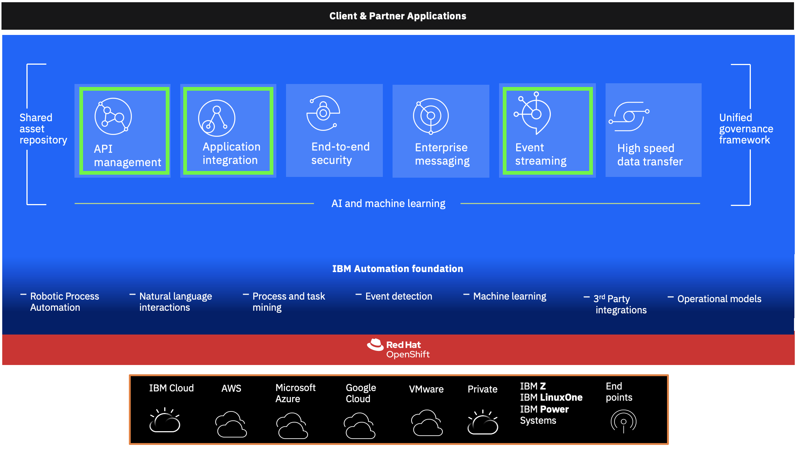
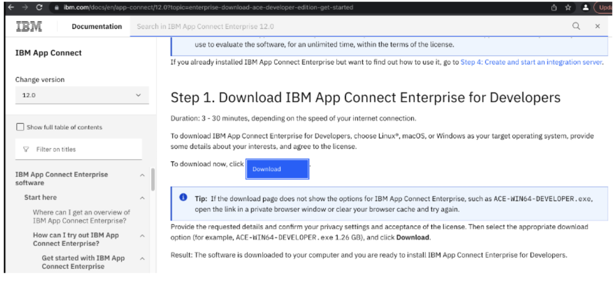
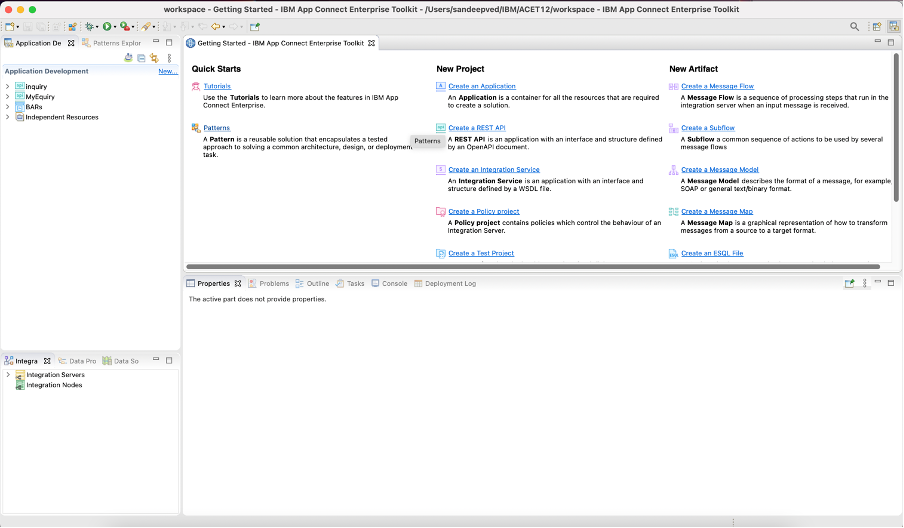
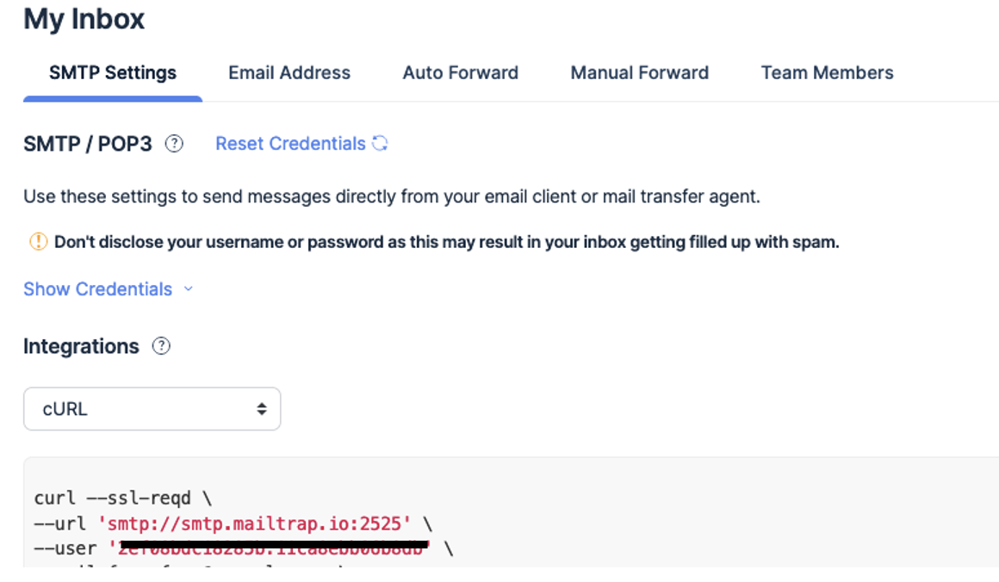

# IBM CP4I Practicum Lab Book for Scenario 1: 

## Description:
### This Practicum Lab Book explains and focuses on the solution preparation and implementation for Practicum Scenario 1 using Cloud Pak for Integration (CP4I). The book will cover the solution architecture and the details of how to best implement the solution for the given scenario. This will help accelerate adoption of Cloud Pak for Integration.

## Table of Contents:

### [Topic 1: Introduction and Scenario Details](#ibm-cp4i-scenaro-1-introduction)
### [Topic 2: Solution Architecture and List of Products Used](#solution-architecture)
### [Topic 3: Introduction to Cluster](#introduction-to-cluster)
### [Topic 4: Solution Build](#solution-build)
#### &nbsp;&nbsp;&nbsp;[Topic 4.1 Prepare Client Tools**](#_Toc105518920)
##### &nbsp;&nbsp;&nbsp;&nbsp;&nbsp;&nbsp;&nbsp;&nbsp;&nbsp;[Topic 4.1.1 IBM App Connect Enterprise (ACE) Toolkit Setup**](#_Toc105518921)
##### &nbsp;&nbsp;&nbsp;&nbsp;&nbsp;&nbsp;&nbsp;&nbsp;&nbsp;[Topic 4.1.2 Openshift Command Line Interface (CLI) Setup**](#_Toc105518922)
##### &nbsp;&nbsp;&nbsp;&nbsp;&nbsp;&nbsp;&nbsp;&nbsp;&nbsp;[Topic 4.1.3 Mailtrap SMTP Setup**](#_Toc105518923)
#### &nbsp;&nbsp;&nbsp;[Topic 4.2: Event Streams](/scenario1/SolutionBuild/IBMEventStreams#solution-build----ibm-event-stream)
#### &nbsp;&nbsp;&nbsp;[Topic 4.3: App Connect](/scenario1/SolutionBuild/IBMAppConnect#ibm-app-connect)
#### &nbsp;&nbsp;&nbsp;[Topic 4.4: Creating Your Rest API](/scenario1/RestAPI/RestAPI.md)
### [Topic 5: Conclusion](#conclusion)

###############################################################################################

# IBM CP4I Scenaro 1 Introduction

# Scenario 1 Description 

- ABC are a Medium sized bank that offers Investments to its high value customers. The bank receive FX (Foreign Exchange) data from a 3rd party via a feed.
- The data from this 3rd party feed is removed once it reaches an age of two weeks.
- As part of a new program at the bank they want to offer access to FX data up to 12 months old via a mobile app to their brokers. The raw data is not in the format required for the business users.
- The Bank historically use IIB and MQ and have bought CP4I. They have also setup a test system to investigate the use of OpenShift and CloudPaks.

### **Challanges**
Your team have (3) days to document your approach to a Solution to the customers business problem using CP4I capabilities and any external capabilities that you think are necessary or useful.
Day 3: Demonstrate your solution to whole class

## Predefined Inboud FX Data
Users can design and construct their own user interface for the FX data inbound. If you may need a helping hand with this please review a sample that was precreated for this exercise [here](../scenario1/Scenario/Interfaces.md).

# Solution Architecture
## High Level Architecture

- Assume we pull FX data from 3rd party application in XML Format and need to be transformed to the format required for the business users. We need an **Application Integration** capabilities for it
- **Event Streaming** will add resiliency to the system and to persist data for 12 month.
- **API Management** will manage and expose internal APIs to the broker apps

## Detailed Solution Flow

1. Inside **IBM App Connect Enterprise** there will be an application that pull the data periodically, transform it to the format required by the business users and publish it in an **IBM Event Streams** topic with specific currency and event life time (12 months). 
2. Second application will be created to query FX data from Topic containing FX data..
3. Query FX flow will be published by **IBM API Connect**, to be consumed by the broker apps

## List of Software Products Used In Scenario

The Cloud Pak for Integration services that we will be use are:
- IBM App Connect Enterprise
- IBM Event Streams
- IBM API Connect

### [Go to the TOP](#ibm-cp4i-practicum-lab-book-for-scenario-1)

# Introduction to Cluster

If you're completely new to the concept of clusters, do follow the quick and easy tutorial [here](https://cloud.ibm.com/docs/openshift?topic=openshift-openshift_tutorial) to learn more
> With Red Hat® OpenShift® on IBM Cloud®, you can create highly available clusters with virtual or bare metal worker nodes that come installed with the Red Hat OpenShift on IBM Cloud Container Platform orchestration software. You get all the advantages of a managed offering for your cluster infrastructure environment, while using the Red Hat OpenShift tooling and catalog that runs on Red Hat Enterprise Linux for your app deployments.

## Introduction to Openshift

OpenShift is a platform that allows you to run containerized applications and workloads and is powered by Kubernetes. It is an offering that comes with Red Hat support, regardless of where you choose to run your applications and workloads. 

One of the big advantages of OpenShift is being able to take advantage of public and private resources which includes bare metal or virtualized hardware whether it is on-premise or on a cloud provider. 

This is the high level OpenShift Container Platform overview.

For developers, OpenShift has two different ways of enabling them to work with their platform. They can take advantage of either the CLI or a web console. 

### [Go to the TOP](#ibm-cp4i-practicum-lab-book-for-scenario-1)

# Solution Build
**Prepare Client Tools**

**IBM App Connect Enterprise (ACE) Toolkit Setup**

Install IBM App Connect Enterprise for developers (also called ACE).
Make sure to select the correct download package for your OS (Windows,
Linux, Mac).

Click on **Download** button on the following
link: [<u>https://www.ibm.com/docs/en/app-connect/12.0?topic=enterprise-download-ace-developer-edition-get-started</u>](https://www.ibm.com/docs/en/app-connect/12.0?topic=enterprise-download-ace-developer-edition-get-started)

The version used in this practicum is 12.0.8

Complete the installation through the installer package you just
downloaded for your OS. eg: 12.0.8.0-ACE-MAC64-DEVELOPER-UNSIGNED. You
can use the IBM ACE Installation page as a guide to complete the
installation.

Once installed, open the installed ACE toolkit. A view similar to the
screenshot below will launch.

**Openshift Command Line Interface (CLI) Setup**

Download Openshift Command line tools (OC Client)

Download OC Client for your platform

Place downloaded oc binary file (oc or oc.exe )to the path in variable for your platform. See the below URL for more details.

https://docs.openshift.com/container-platform/4.10/cli_reference/openshift_cli/getting-started-cli.html 

Alternate URL Reference: https://mirror.openshift.com/pub/openshift-v4/x86_64/clients/ocp/stable-4.10/

**Mailtrap SMTP Setup**

Signup for a SMTP account on mailtrap.io. Once logged in, note down your
SMTP connection settings. For Example,

Host: smtp.mailtrap.io

Port: 2525

User: 2ef08bdc18285b

Password: 11xxxxxx06b8da

You can also check all your emails under MyInbox in mailtrap web site.

## [Event Streams](/scenario1/SolutionBuild/IBMEventStreams/README.md)
## [App Connect](/scenario1/SolutionBuild/IBMAppConnect/README.md)
## [Creating Your Rest API](/scenario1/RestAPI/RestAPI.md)

# Conclusion
The above completes details for setup, installation and configuration of Cloud Pak for Integration for Scenario 1. As we conclude our work on the Practicum, you will now be well acquainted with the basic fundamentals and usage of Cloud Pak for Integration. This will assist you in your journey to Modernising Applications and keep up to speed with the technology and trends.

### [Go to the TOP](#ibm-cp4i-practicum-lab-book-for-scenario-1)