# FX Data Consumer

## Creating REST API in ACE (App Connect Enterprise) Toolkit

In this section, we will be using the ACE Toolkit to create a REST API. To install the ACE Toolkit, head [here](https://www.ibm.com/docs/en/app-connect/11.0.0?topic=sh-how-can-i-try-out-app-connect-enterprise)

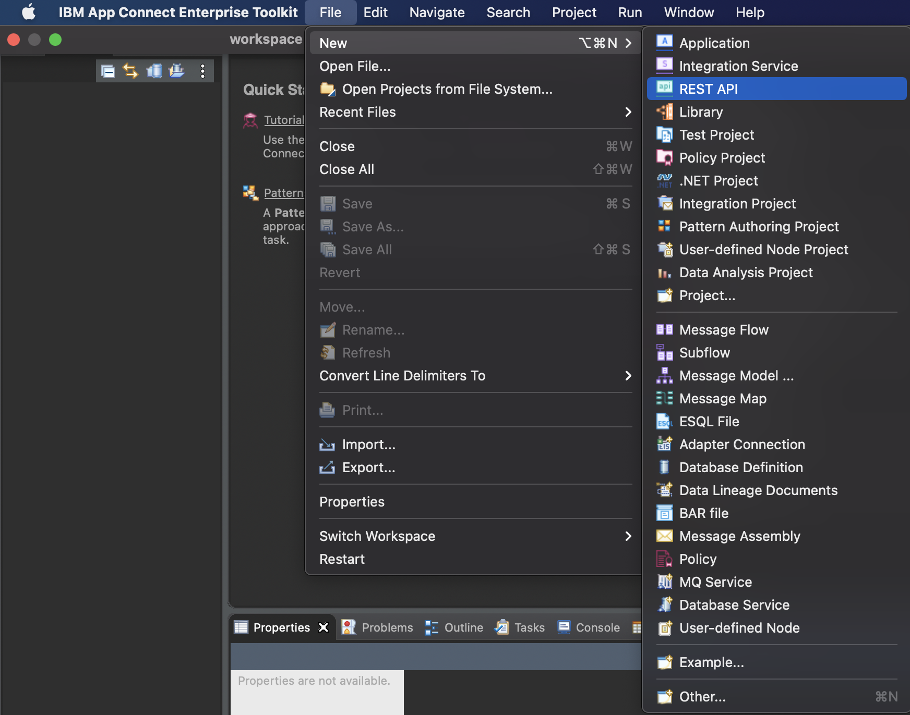

Once you have downloaded the ACE Toolkit, get acquainted and comfortable with the interface. Now, let's create a new REST API. Simply click on **File**, followed by **New**, and select **Rest API**.  

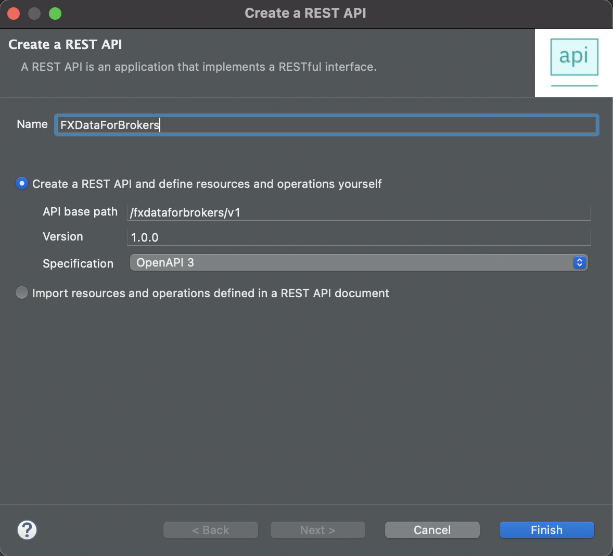

A pop-up window will appear where you are required to enter the name of the REST API. Do note that you cannot have two projects with the same name in the same workspace so ensure that the name is unique. 

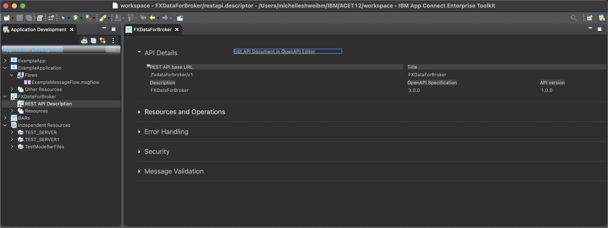

Once the REST API is created, you will see the above screen. Now, we have to work on the **OpenAPI Editor**. Click on the hyperlink that will open up another window - that will be the OpenAPI Editor. 

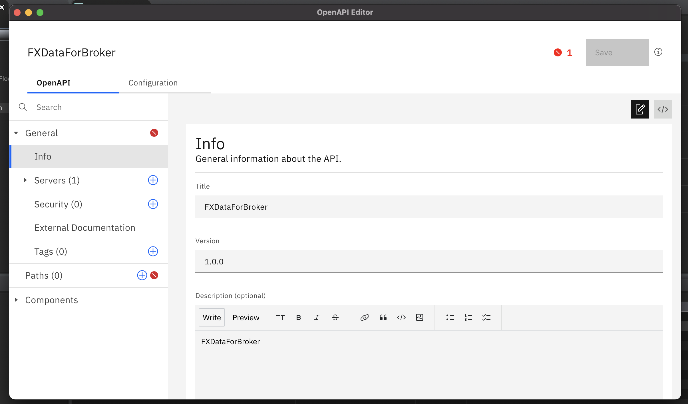

Now, once the above screen appears, we can begin working on our OpenAPI Editor. 

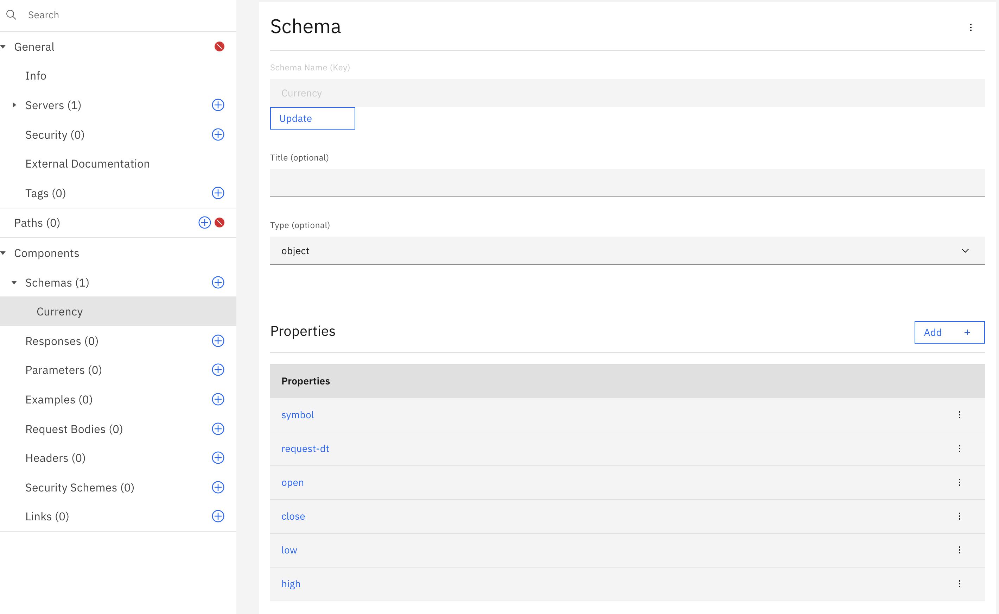

Firstly, we will have to define the schemas. In our `Currency` schema above, we have defined the properties: symbol, request-dt, open, close, low and high. This relates to the currencies whereby

1) symbol is the symbol of the currency (USD, SGD, CAD etc.)
2) request-dt is the date and time of the request 
3) open is the opening currency rate for the day
4) close is the closing currency rate for the day
5) low is the lowest currency rate for the day
6) high is the highest currency rate for the day 

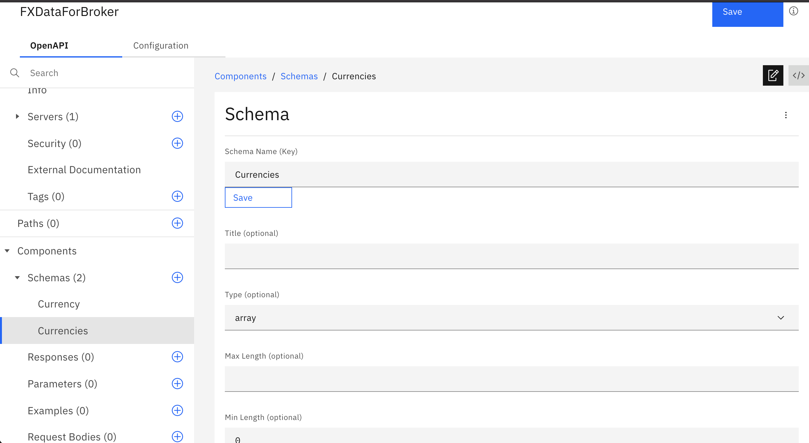

Our `Currencies` schema is simply an array with 0 min. length. This is to store the currency queries. 

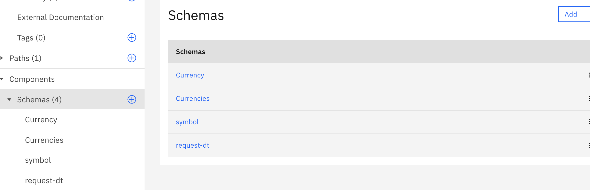

Our aim is to create four currencies as seen in the screenshot above. `Currency`, `Currencies` (array), `symbol` (currency symbol) and `request-dt` (request date and time) 

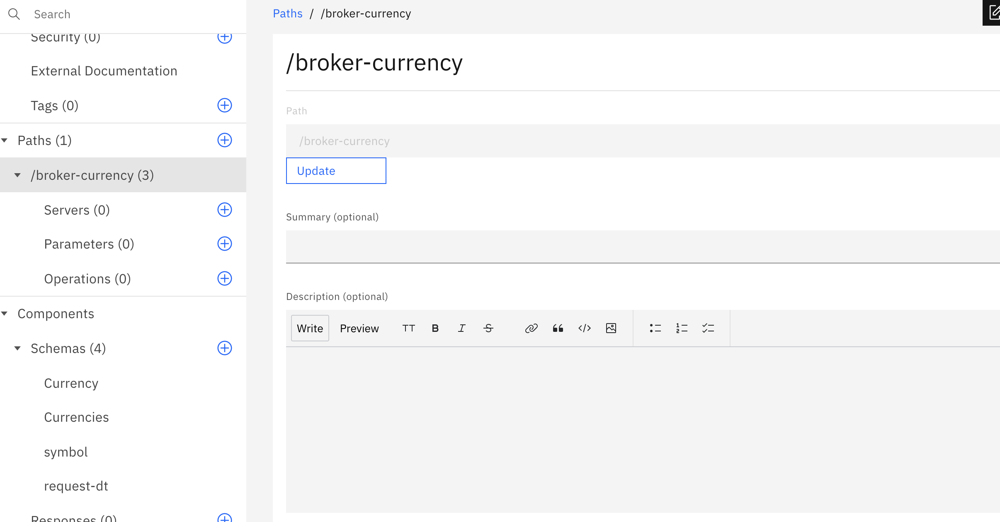

Now, let's work on the `path` to link our schemas together. In this example, we have named our path `broker-currency`

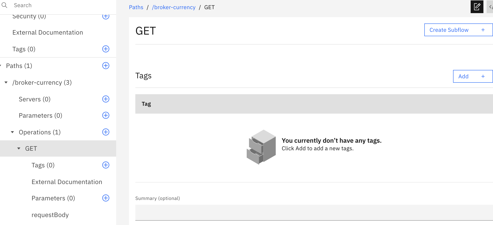

The first step is to define the operations. Here, we need a `GET` operation. So let's create that and fill it up as we go along. 

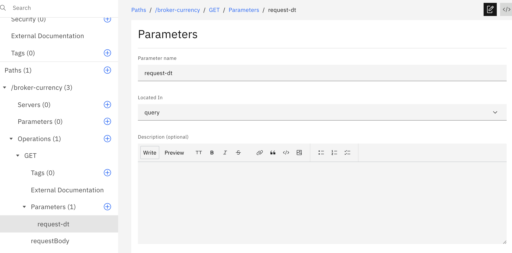

First, our parameter will be the `request-dt` schema that we defined in the previous steps. Link it to the parameter in this `GET` operation. 

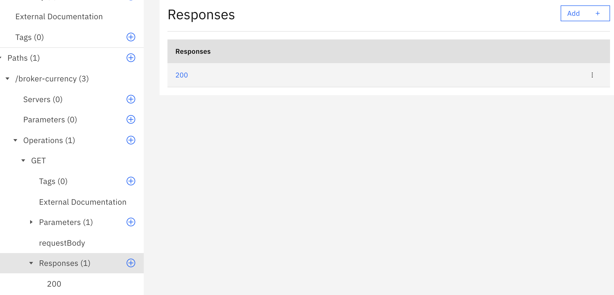

In the responses section, we will select `200`. This is a standard response code for successful HTTP requests. 

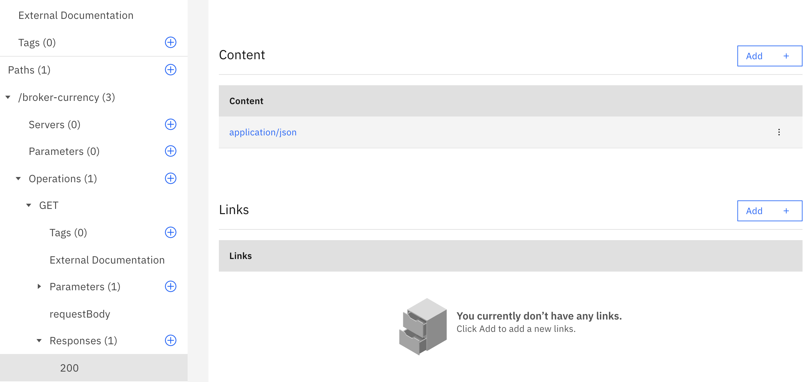

Scroll down to the `Content` portion where we will add a `application/json` file.

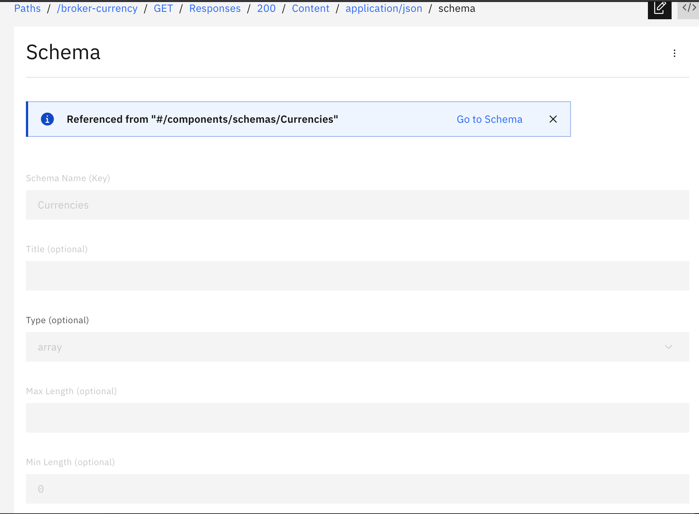

Within this `application/json` file, simply link it to the `Currencies` schema which we defined earlier. 
