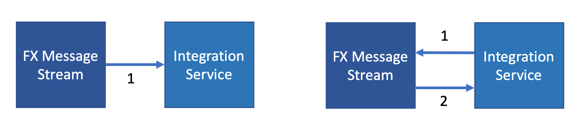
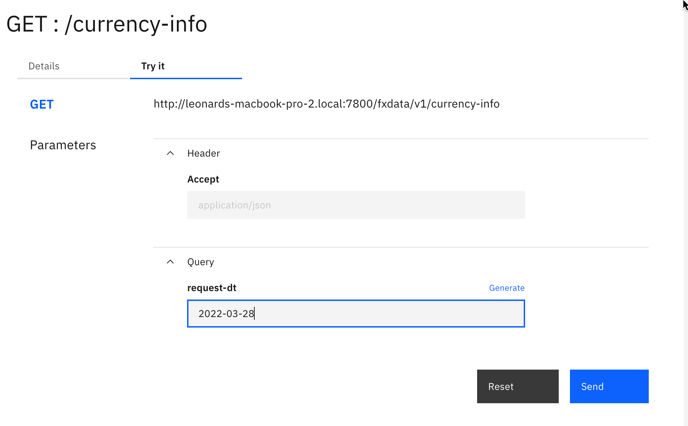
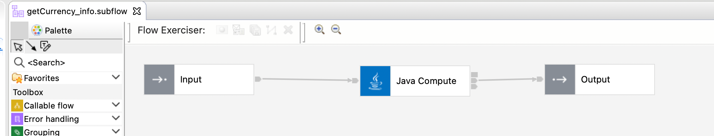
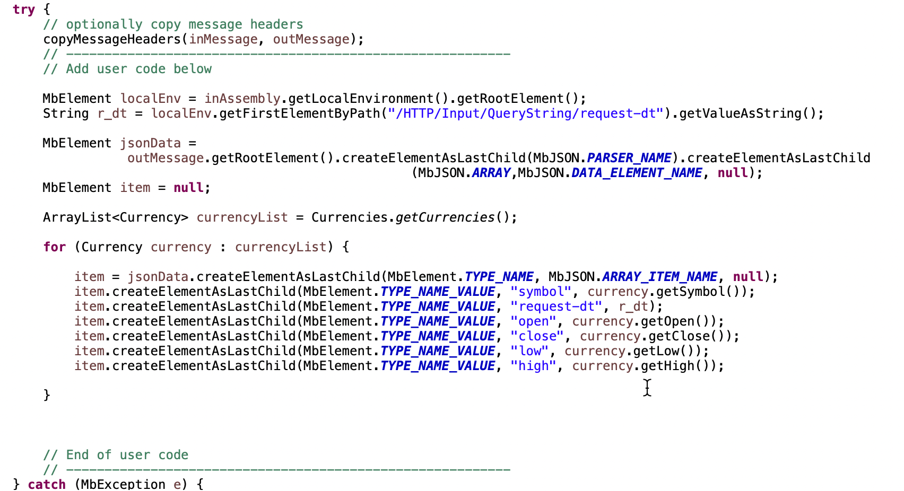
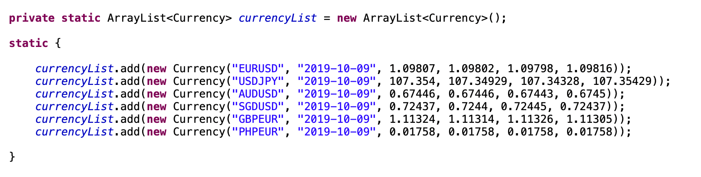

# Integration Interfaces 
A student in this practicum you may the scenario has loosely defined the interaction but has not explicitly defined the integration models.

So you will need to make some assumptions about how this interaction may work. In the case of the FX Mesage Stream there are two possible message interaction models.

1. A push model where the FX Stream is pushed to the customer and 
2. A pull model where the customer system calls to the FX stream provider for data.



As you asses the and plan the interaction models you will need to consier and make decsions for the the following
1. Communication interration mode synchronous/asynchronous
2. Communication transport HTTP/MQ ...
3. Preferred data message format JSON/XML ...
4. Frequency of interaction.

For those that want to focus their integration energies in other parts of the practicum we will now outline a predefined integration model with a predefined interface

## Predefined Interface

For this predefined integration model we assumed the following

The service will be initated from the customer to the FX provider using a REST call to the FX Provider this will be executed daily.
The FX Provider will respond with the list of currencies. The data structure of the response will consist of the a list of Currency each list item including the currency symbol, the request date, the opening rate, closing rate, daily high and daily low.

The service definition is defined here
[FXData YAML](../../scenario1/Scenario/fx-assets/FXData-1.0.0.yaml)

### Example Input
The service is defined to accept a single http query parameter called reques-dt.




### Example Output
```
[
    {
        "symbol": "EURUSD",
        "request-dt": "2019-10-09",
        "open": 1.09807,
        "close": 1.09802,
        "low": 1.09798,
        "high": 1.09816
    },
    {
        "symbol": "USDJPY",
        "request-dt": "2019-10-09",
        "open": 107.354,
        "close": 107.34929,
        "low": 107.34328,
        "high": 107.35429
    },
    {
        "symbol": "AUDUSD",
        "request-dt": "2019-10-09",
        "open": 0.67446,
        "close": 0.67446,
        "low": 0.67443,
        "high": 0.6745
    },
    {
        "symbol": "SGDUSD",
        "request-dt": "2019-10-09",
        "open": 0.72437,
        "close": 0.7244,
        "low": 0.72445,
        "high": 0.72437
    },
    {
        "symbol": "GBPEUR",
        "request-dt": "2019-10-09",
        "open": 1.11324,
        "close": 1.11314,
        "low": 1.11326,
        "high": 1.11305
    },
    {
        "symbol": "PHPEUR",
        "request-dt": "2019-10-09",
        "open": 0.01758,
        "close": 0.01758,
        "low": 0.01758,
        "high": 0.01758
    }
]
```

## Setting Up Predefined FX Data
Also provided here is a project intercahnge file that can be customized. 
[FXData.zip](../../scenario1/Scenario/fx-assets/FXData.zip)
To utilize the FXData flow as a quick start to simulate the data provider.

1. Import the FXData.zip to ACE Toolkit
2. Create a Bar File
3. Build and save the bar file
4. Create a Integration server in FX Data project
5. Test exposed integration.


<BR> The file creates a standard response that substitutes the request date. The practicum squad can use this as a started and expand on the capabaility to be more elaborate if they choose to. <BR>



<BR> The jave Compute Node contains the logic for creating the default list and substituting the date <BR>



<BR> The currency list is predefined in the Currencies.java class <BR>



[Return to Scenario main page](../README.md)


