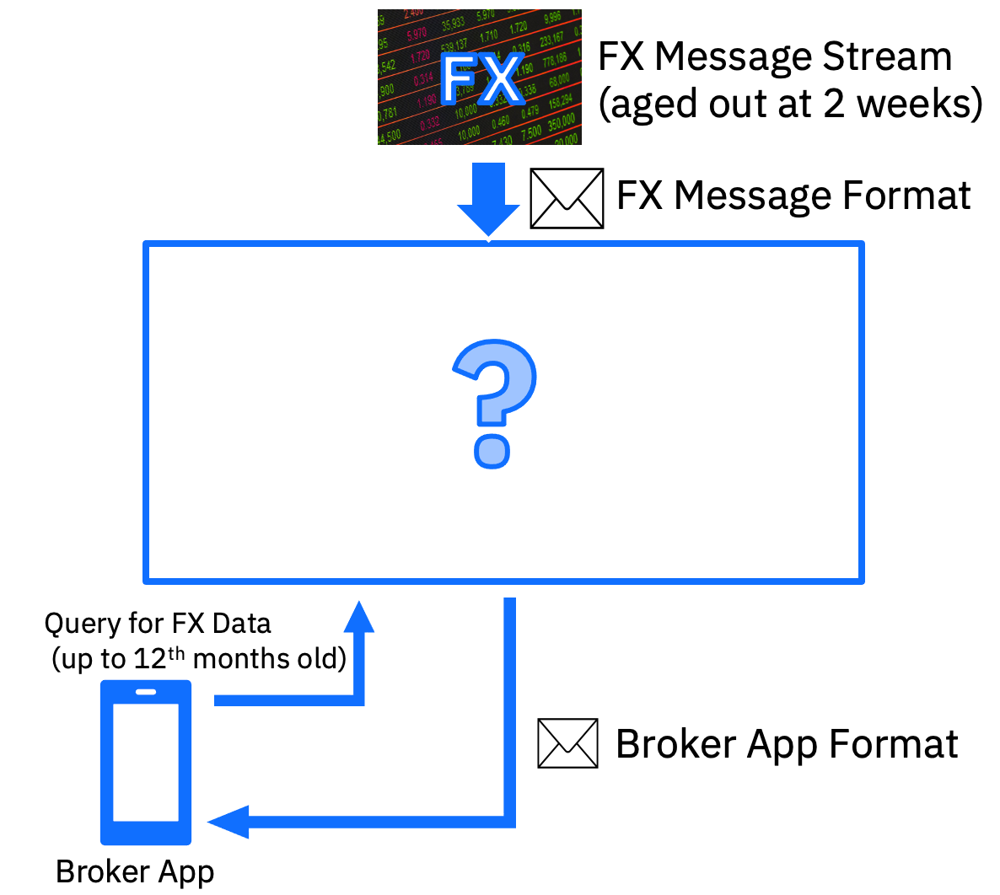

# Scenario 1 Description 

- ABC are a Medium sized bank that offers Investments to its high value customers. The bank receive FX (Foreign Exchange) data from a 3rd party via a feed.
- The data from this 3rd party feed is removed once it reaches an age of two weeks.
- As part of a new program at the bank they want to offer access to FX data up to 12 months old via a mobile app to their brokers. The raw data is not in the format required for the business users.
- The Bank historically use IIB and MQ and have bought CP4I. They have also setup a test system to investigate the use of OpenShift and CloudPaks.

### **Challanges**
Your team have (5) days to document your approach to a Solution to the customers business problem using CP4I capabilities and any external capabilities that you think are necessary or useful.
Day 5: Demonstrate your solution to whole class

## Predefined Inboud FX Data
Users can design and construct their own user interface for the FX data inbound. If you may need a helping hand with this please review a sample that was precreated for this exercise [here](Interfaces.md).