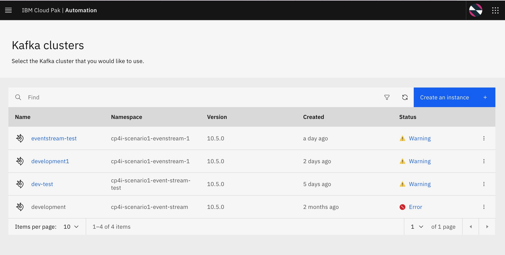
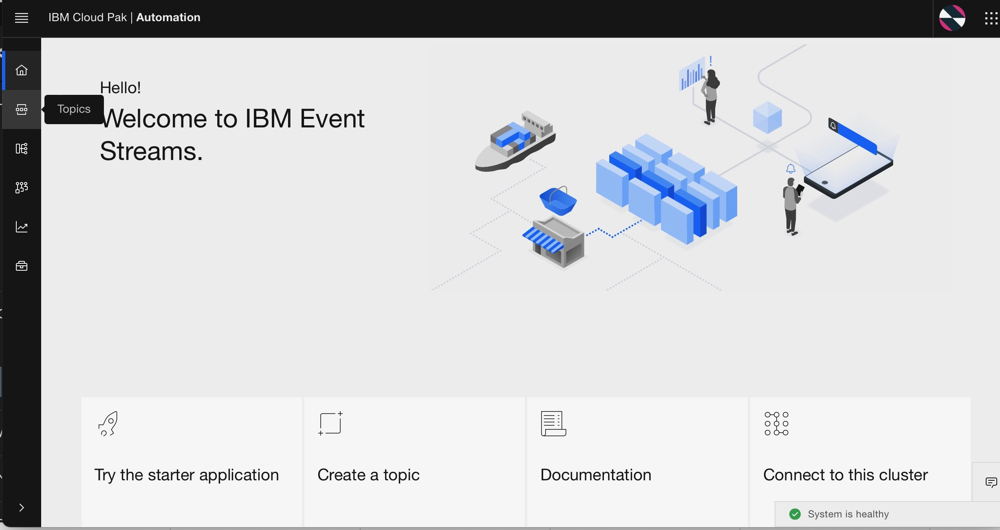
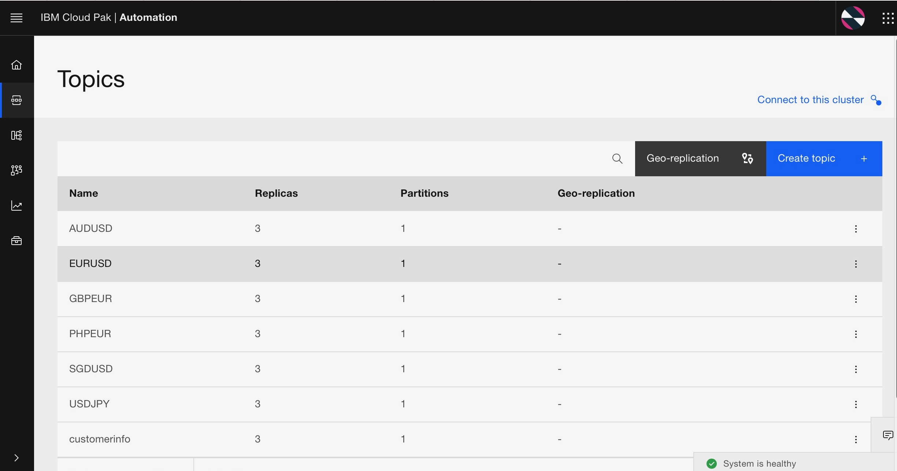
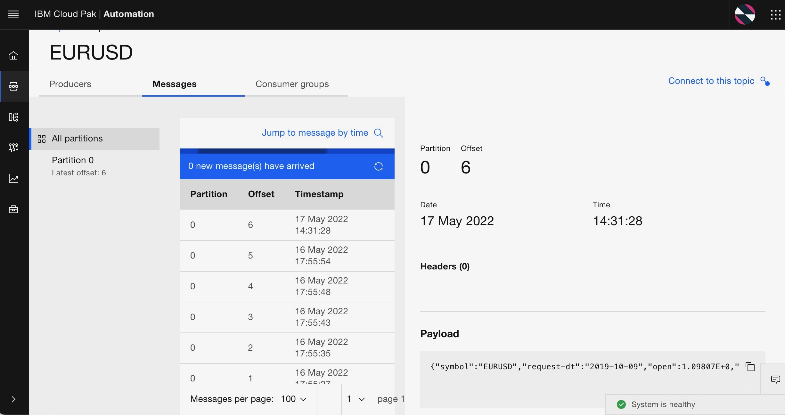

# Solution Build -  IBM Event Stream
IBM Event Streams is an event-streaming platform based on the open-source Apache Kafka® project. So it will be good if you have some understanding of [kafka key concept](https://ibm.github.io/event-streams/2019.4/about/key-concepts/).

In this section we will go through on how to create IBM Event Streams topic that will be used in our solution. Please refer to [this link](https://ibm.github.io/event-streams/getting-started/creating-topics/) on how to create Kafka topic in IBM Event Streams.

For this scenario we will need to create some topics that will store data for each currency. Repeat the Create Topic steps to create below topics.
- EURUSD
- USDJPY
- AUDUSD
- SGDUSD
- GBPEUR
- PHPEUR

## Create Topic
1. From IBM Integration Navigator page, find "Event streaming" and click on the created Event Streaming instance.

2. In your IBM Event Streams main page, choose "Create a topic"

3. In the first page of Create topic wizard, choose the topic name that you  will create. In this example we will create a topic to keep FX data for EUR to USD. Click next after you filled the topic name.

4. Next step will be determine how much partition(s) you will create. It will depends on how much consumer that will consume the event from this topic.

5. In message retention part, we will set on how long the message will be retained. In our case we will retain the message for 12 months. Feel free to create a topic with shorter retention time (eg 2 min) if you want to see kafka message retention feature.

6. Select a replication factor in Replicas. This is how many copies of a topic will be made fo high availability. We can have 1 partition for this excercise. Click "Create topic" to finish topic creation.

7. Check on the topic list and make sure that your topic already created.

### Consideration for production environment
1. Partition should be created depends on how many consumer / consumer group you have
2. For production environments, select **Replication factor: 3** as a minimum.

## Preparing Client Connection
### 1. Connect to Kafka Cluster

#### Authentication

Kafka uses SASL to perform authentication  and it currently supports many mechanisms including
PLAIN, SCRAM , OAUTH etc. and it allows administrator to plug custom implementation. Check  [this page](https://ibm-cloud-architecture.github.io/refarch-eda/technology/security/) to know more about kafka security overview.

1. From IBM Event Stream main page, choose Connect to ES cluster

2. To connect the cluster, you need the address of kafka listener,credential,and a certificate. ,Firstly, copy 
the bootstrap server(External) and then click “Generate SCRAM credentials “ to get permission to access topic.

3. Next steps, we'll need to fill some values below

| Option        | Value           |
| ------------- |:-------------:|
| Credential name      | your credential name |
| What do you want your application to do?   | Produce messages, consume messages and create topics and schemas      |
| Which topics does the application need to access?  | All topics      |
| Which consumer group does the application need to access?       | All consumer group |
| Choose which transactional IDs the application can access      | All transactional IDs |

4. Note down SCRAM username and SCRAM password. They will be used later.

### 2. Download certificate
1. After that, on cluster connection page, scroll down to Certificate section and download PKCS12 certificate,
   and click Download certificate.

2. You will see the PKCS12 certificate password, Copy it .

### 3. Building and configuring message flow in App Connect to integrate with Event Stream

Check out [this page](https://www.ibm.com/docs/en/app-connect/11.0.0?topic=messages-using-kafka-app-connect-enterprise) to understand how to use Kafka with IBM App Connect Enterprise before you begin

You already have created a topic in Event Strem , and now you need to build message flow to pull FX data from FX Provider and transform the data format to produce message and send it to the Event Stream topic based on currency symbol  EURUSD etc. You will have to build the message flow and generate a BAR file to deploy in the Integration Dashboard. 

1) Start App Connect Enterprise and create App Connect Enterprise workspace directory, for example , workspace directory as ace-fxcurrency folder (~/IBM/ACET11/workspace/ace-fxcurrency). Click OK.

2) Assume that you already have good foundation on App Connect and know how to create REST API or you can learn from [this link ](https://www.youtube.com/watch?v=1WimJ1HPTIk) you can create a project for building the message flow 

3) Before working on the message flow, you need to create a policy project. Check [this link](https://github.ibm.com/ASEANZK-CP4I-Practicum/scenario1/tree/main/Solution%20build/IBM%20App%20Connect/) for App Connect Section and learn how to 
create a policy project and some configurations that you need to know 

### 4. After deploying App Connect and testing successfully in previous step, check the message in topic in EventStrem 

1. Back on the main menu IBM Automation Dashboard, under Design section you select kafka clusters 

  

2.  You can see the kafka cluster under namespace that you define with the status , Click the cluster 

  

3. Now you can see IBM Event Stream page, on the menu you can select Topic

  
  
4. You see the list of currency topics that you build, and select EURUSD topic to see the message 

  

5. Now you can see in EURUSD topic, and list of messages with offset and can see the message data
   in the payload section

  

