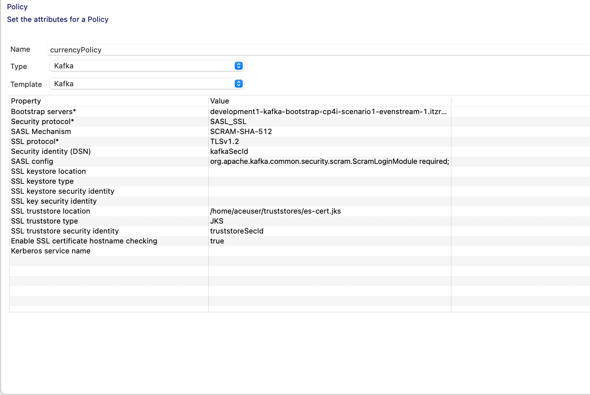
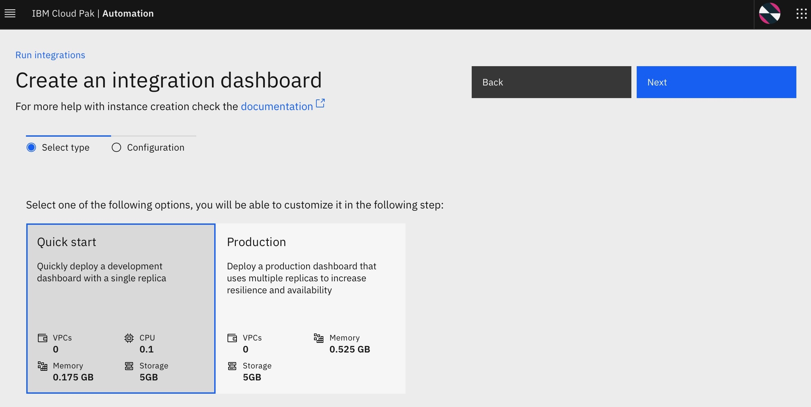
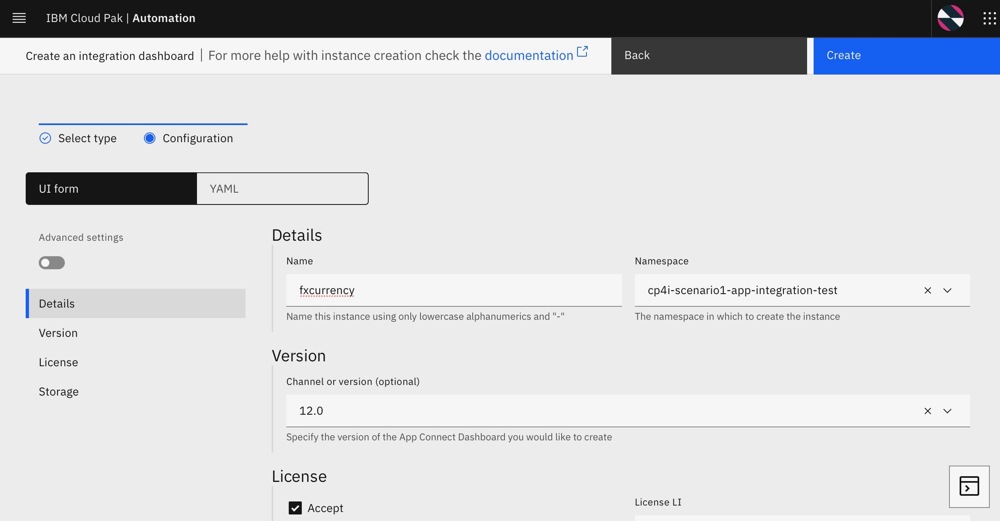
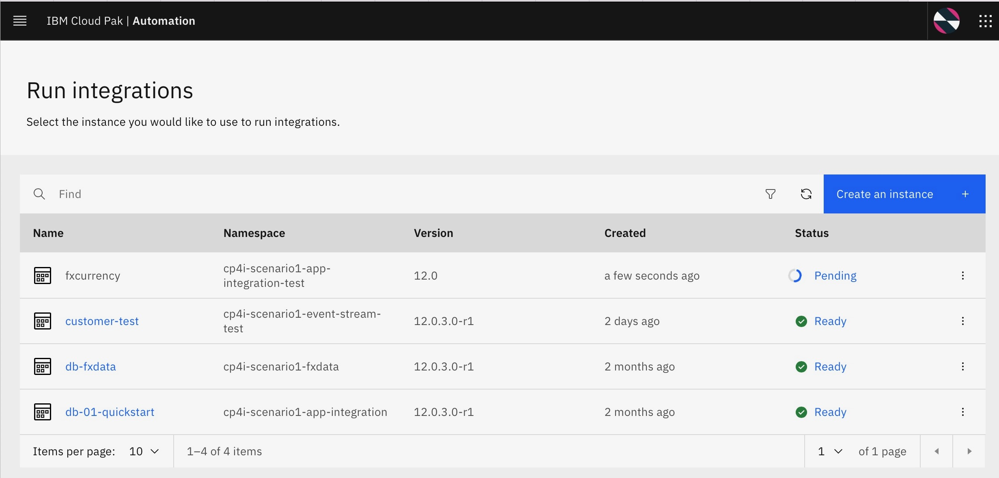
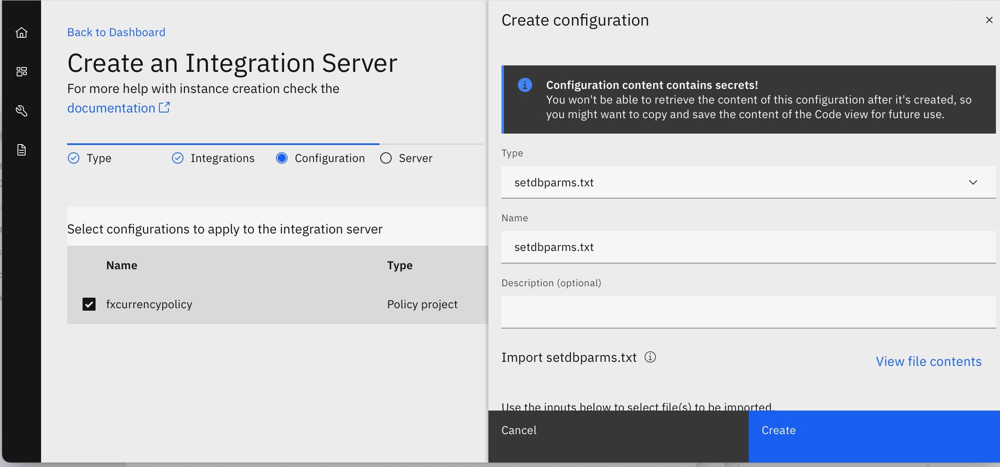
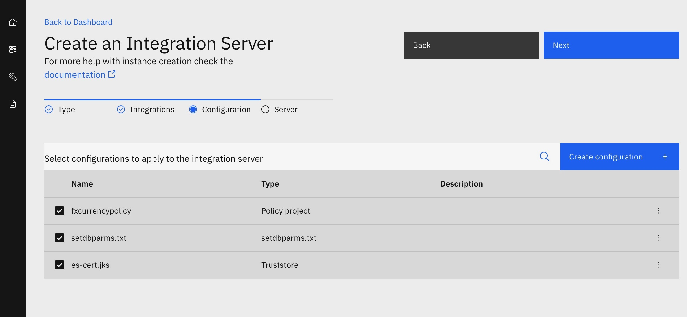
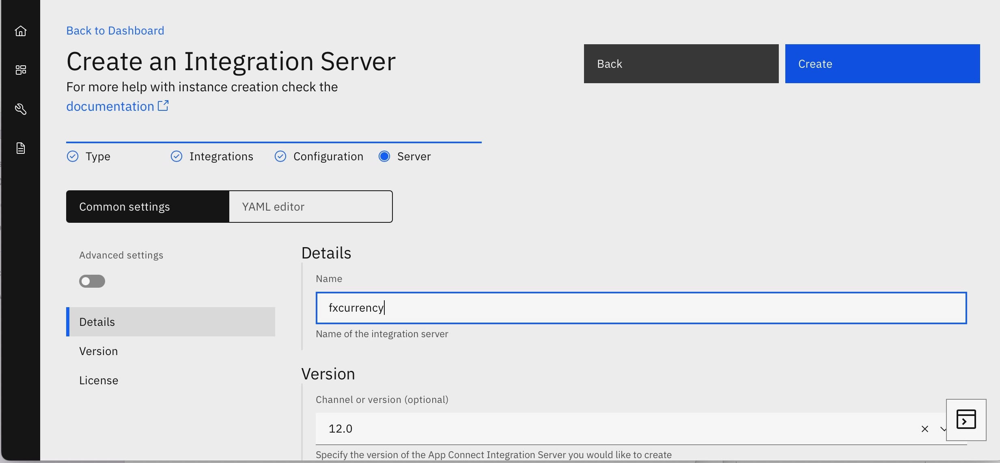
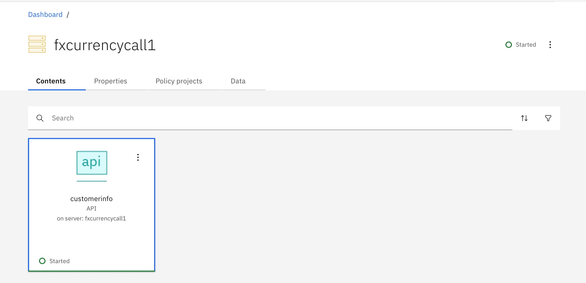
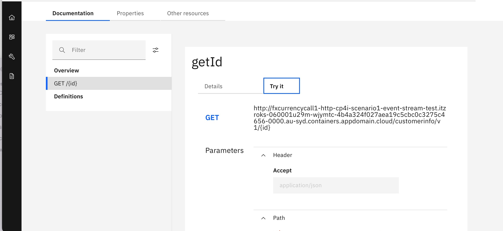
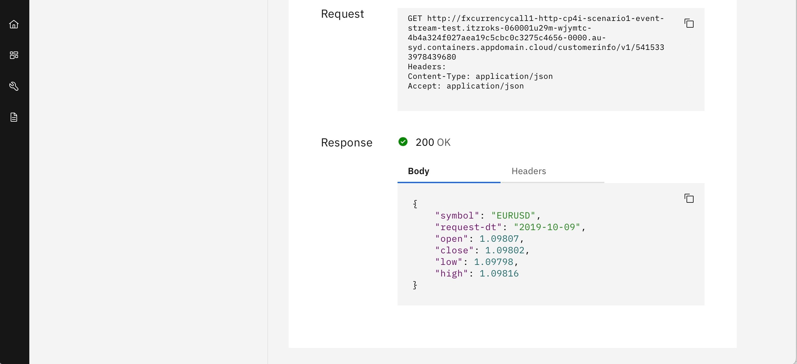

# IBM APP Connect
## How to use IBM App Connect with IBM Event Stream
In this section we'l find out how to use the IBM App Connect Enterprise Kafka nodes to produce and consume messages on Kafka topics. You can read the documentation [here](https://www.ibm.com/docs/en/app-connect/12.0?topic=messages-using-kafka-app-connect-enterprise) or watch [the example video](https://youtu.be/XyNy7TcfJOc).
### Create Kafka Policy and configuring App Connect
1. First, we need to create Kafka Policy to connect with Kafka topic on IBM Event Stream. To do it, just right click on the Application Development palette, choose new > Policy

2. In the Policy creation wizard, fill the option with the value describe in below table, then click Finish

| Option        | Description          |
| ------------- |:---------------:|
| Policy Project             | the name of your policy project             |
| Policy name | the name of your policy |

3. Next, we will fill the mandatory policy attributes as shown below. some values can be found in setting up [IBM Event Stream](../IBM%20Event%20Streams/README.md#Preparing%20Client%20Connection) section.

| Property       | Description / Value          |
| ------------- |:---------------:|
| Type  | Kafka  |
| Bootstrap Server  | Link when you generating SCRAM credential  |
| Security protocol  | SASL_SSL  |
| SASL Mechanism  | SCRAM-SHA-512  |
| SSL protocol  | TLSv1.2  |
| Security identity (DSN)  | ACE param contains SCRAM user and password   |
| SASL config  | org.apache.kafka.common.security.scram.ScramLoginModule required;  |
| SSL trustore location  | location of truststore (in ACE container deployment the location will be inside /home/aceuser/truststores/ folder)  |
| SSL trustore type  | JKS or PKCS12 (depends on what truststore you will use)  |
| SSL trustore security identity  | ACE param contain trustore password  |
| Enable SSL certificate hostname checking  | true  |

### Producing message on Kafka topics
1. To produce message to kafka topic, we can use Kafka Producer node.

2. In basic properties, we only need to set "Topic Name" with the destination topic and "Client Id" with SCRAM user.

3. In security properties , ensure that we set value  Security protocol as SASL_SSL and SSL protocol as TLSv1.2

 

4. In policy tab, set the value with the policy that already created

5. Now, you need to deploy the fxcurrency application in App Connect Enterprise server. Select the fxcurrency application. 
Click File-> New-> BAR file, then enter fxcurrency as BAR file name and click Finish.

6. Check fxcurrency application box on the REST API tree , If necessary scroll right to check Compile and in-line resource and click Build and Save.

7. Then, check policies and check fxcurrencyPolicy. Click Build and Save and OK on Override Configurable Properties.

8. Now ,you have a BAR file and policy created in App Connect Enterprise, Find ~/IBM/ACET11/workspace/ace-fxcurrency
locate fxcurrencyPolicy folder and compress it as Zip file

9. Create setdbparams.txt,check the example below 

10. Optionally , in case you need to use keyStore in JKS , we can covert es-cert.p12 into es-cert.jks using keytool command
make sure you install Java JRE , then you will be able to use keytool

Example command below, 

and EwFFE8Fq3KKN = certificate password

keytool -importkeystore -srckeystore es-cert.p12 -srcstoretype PKCS12 -destkeystore es-cert.jks -deststoretype JKS -srcstorepass EwFFE8Fq3KKN -deststorepass EwFFE8Fq3KKN -noprompt

### Deploying App Connect Enterprise

App Connect Enterprise toolkit generated a BAR file, which has all information to run app connect instance.
and for this modernization, the operator-based approach has been introduced for packing , deploying and 
managing App Connect in container environment. 

1. In order to deploy App Connect,you need to access IBM Automation Dashboard via Cloud Pak Platform Navigator link provided in Openshift , Once you log in successfully with credentials , you will see the dashboard , for example, below

2. On Menu,under Run section you can select integration , it will take you to Run Integration page, then you will be able to create your own integration dashboard instance

3. Select Quick start for non-production and Next 

4. You need to fill in configuration details for creating integration dashboard and accept License

5. Once you create the instance, it will take a while to provision integration dashboard [pending status]  and you will need to wait until the status is Ready , then you can access it

6.Click the instance that you just created,  you will see the dashboard , then you can create integration server instance

7. Choose Quick Start for creating Integration server , then Next
       

8. Upload the bar file into integration server

9. Create configuration for Integration server, 

   9.1 Policy project  ( create config & upload policy project (zip file)

   9.2 setdbparam.txt (create config & upload the file)

   9.3 Truststore ( create config & upload certificate that you created)

        

       
10 Select configuration that you want to apply to integration server 

11 Fill in the configuration details for creating Integration server

12  You can see you integration server created under the dashboard

13. You can see the API that you build 

        
14  You can test your API

       
15 The result from your API that call 

16 After testing, you can go back to see the result that the message is
sent to the specific topic in EventStrem that you define in app connect.
Carry on the EventStream part from [this page](https://github.ibm.com/ASEANZK-CP4I-Practicum/scenario1/tree/main/Solution%20build/IBM%20Event%20Streams)  under the topic Check the message in the Topic in EventStrem Cluster

      
      
### Consuming message from Kafka topics

To understand on consuming message from kafka , you can check out 
[this page](https://www.ibm.com/docs/en/app-connect/11.0.0?topic=enterprise-consuming-messages-from-kafka-topics) 

