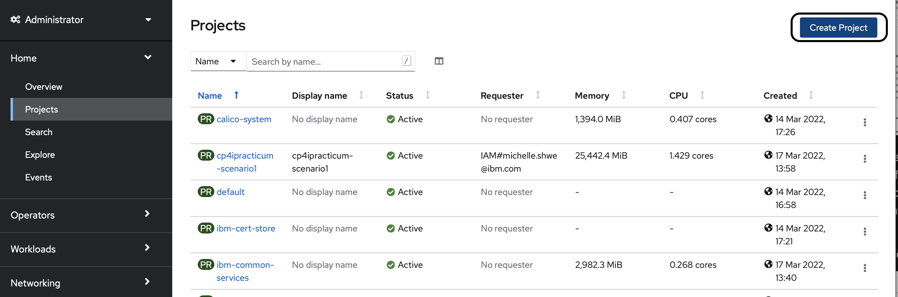
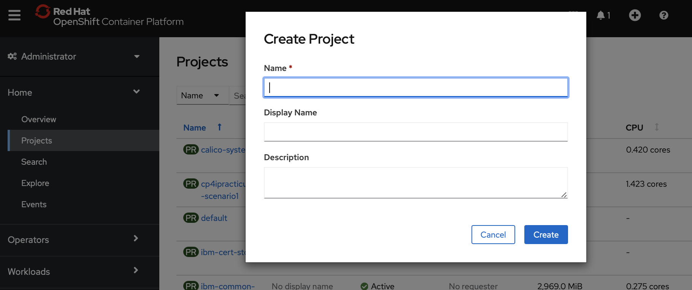
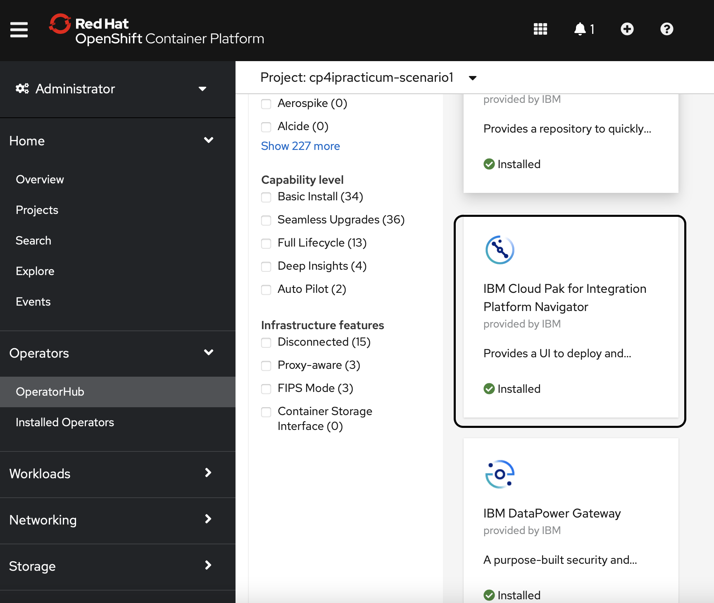
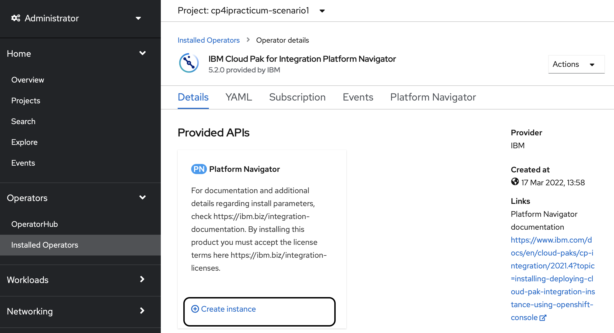
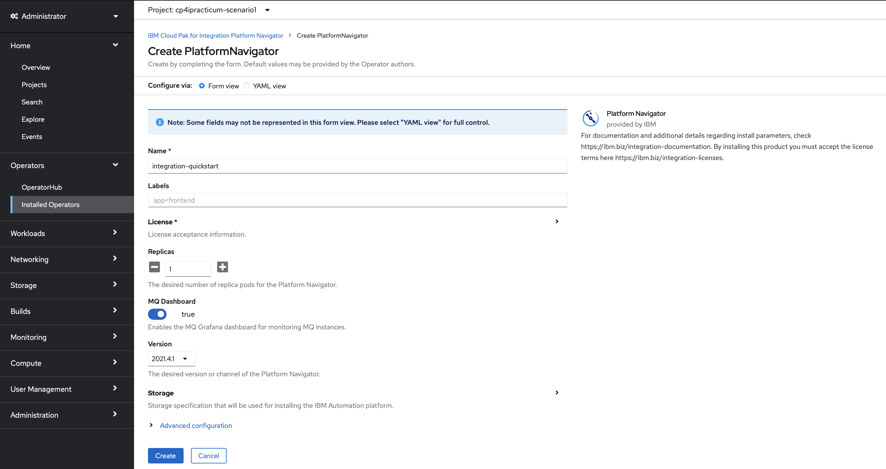
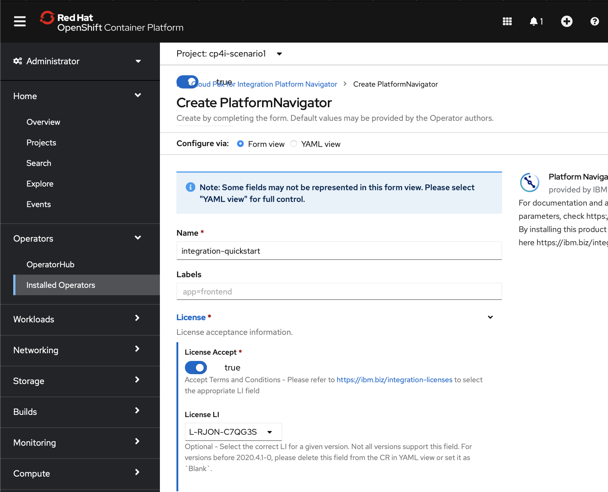
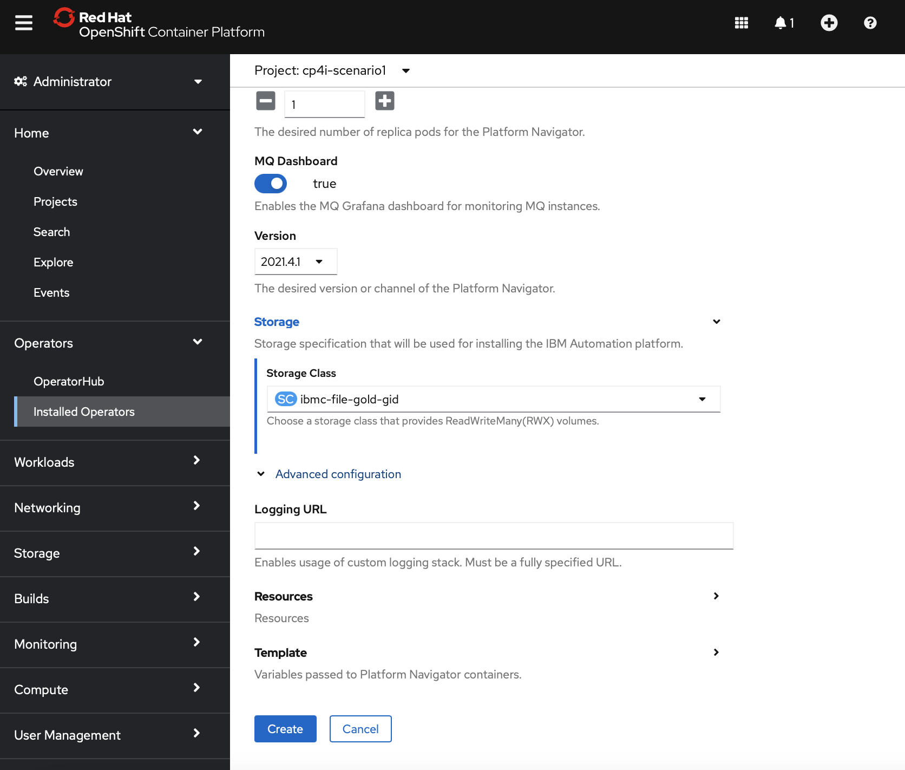

# Section 5: Installation and Configuration

## 5.1 Cluster and Openshift

### 5.1.1 Introduction to Cluster

If you're completely new to the concept of clusters, do follow the quick and easy tutorial [here](https://cloud.ibm.com/docs/openshift?topic=openshift-openshift_tutorial) to learn more
> With Red Hat® OpenShift® on IBM Cloud®, you can create highly available clusters with virtual or bare metal worker nodes that come installed with the Red Hat OpenShift on IBM Cloud Container Platform orchestration software. You get all the advantages of a managed offering for your cluster infrastructure environment, while using the Red Hat OpenShift tooling and catalog that runs on Red Hat Enterprise Linux for your app deployments.
### 5.1.2 Introduction to Openshift

OpenShift is a platform that allows you to run containerized applications and workloads and is powered by Kubernetes. It is an offering that comes with Red Hat support, regardless of where you choose to run your applications and workloads. 

One of the big advantages of OpenShift is being able to take advantage of public and private resources which includes bare metal or virtualized hardware whether it is on-premise or on a cloud provider. 

This is the high level OpenShift Container Platform overview.

For developers, OpenShift has two different ways of enabling them to work with their platform. They can take advantage of either the CLI or a web console. 

### 5.1.3 Install CP4I Operators

Installing CP4I operators is a two-step process. Firstly, you will follow the steps [here](https://www.ibm.com/docs/en/cloud-paks/cp-integration/2020.2?topic=installation-adding-online-catalog-sources-cluster) to add online catalog sources to a cluster. After completion of that step, you will then install the CP4I Operaters by following the step [here](https://www.ibm.com/docs/en/cloud-paks/cp-integration/2020.2?topic=installation). 

If you are new to Operators, follow [this link](https://www.ibm.com/docs/en/openshift?source=https%3A%2F%2Fdocs.openshift.com%2Fcontainer-platform%2F4.4%2Foperators%2Folm-what-operators-are.html&referrer=SSGT7J_20.2%2Finstall%2Finstall.html) to read more about them. 

### 5.1.4 Creating Projects 

Head to the Red Hat OpenShift Web Console, ensure that you are on Administrator view. Click on "Projects" in the left panel. On the top right hand corner, you will see the button to "Create Project" (encircled in black).

Fill in the details accordingly and hit "Create". 

### 5.1.5 Add Entitlement Keys

Firstly, follow the steps [here](https://www.ibm.com/docs/en/cloud-paks/cp-integration/2021.4?topic=installing-applying-your-entitlement-key-online-installation#obtaining-your-entitlement-key) to obtain your entitlement key. After which, you will add the entitlement key you have just obtained to the cluster as a pull secret to deploy Cloud Pak for Integration capabilities. To do so, follow the steps [here](https://www.ibm.com/docs/en/cloud-paks/cp-integration/2021.4?topic=installing-applying-your-entitlement-key-online-installation#applying-pull-secret__web-console).

### 5.1.6 Install Platform Navigator

In your OpenShift Web Console, ensure that you are on the Administrator view. Click on "OperatorHub" on the left panel, scroll down until you see "IBM Cloud Pak for Integration Platform Navigator" (encircled in black) and install that. 

### 5.1.7 Create Instances

Now that we have installed the Platform Navigator, we can create an Instance of it. Click on Installed Operators on the left panel and scroll down to the Platform Navigator. Click on "Create Instance" (encircled in black). 

This will lead you to the following page:

Fill in the details for License as shown below:

For Storage, choose `ibmc-file-gold-gid` for the storage class:

