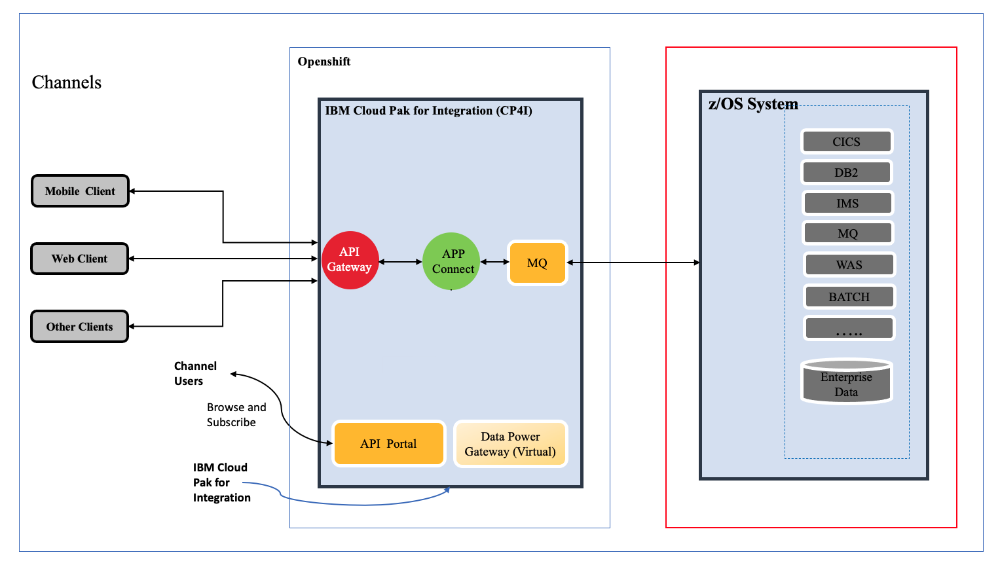
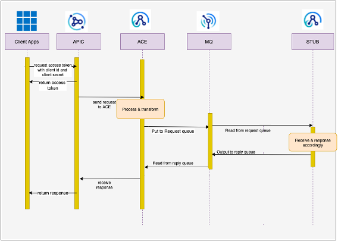
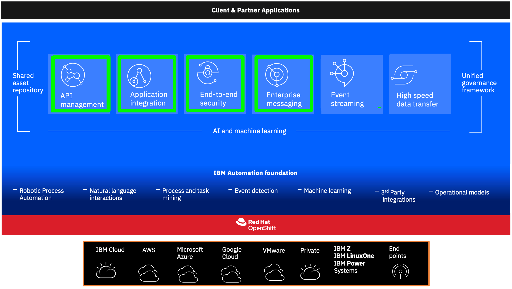

# Solution Architecture

### [Topic 3.1: High Level Architecture](README.md#high-level-architecture)
### [Topic 3.2: Detailed Solution Flow](README.md#detailed-solution-flow)
### [Topic 3.3: List of Software Products Used In Scenario2](README.md#list-of-software-products-used-in-scenario2)

#### [Topic 3.3.1: IBM App Connect Enterprise](README.md#ibm-app-connect-enterprise)
#### [Topic 3.3.2: IBM Event Streams](README.md#ibm-event-streams)
#### [Topic 3.3.3: IBM API Connect](README.md#ibm-api-connect)
#### [Topic 3.3.4: IBM Enterprise Messaging (MQ)](README.md#ibm-enterprise-messaging-mq)

## High Level Architecture

## Detailed Solution Flow

## List of Software Products Used In Scenario2

The Cloud Pak for Integration services that we will be use are:

### IBM App Connect Enterprise

IBM Cloud Pak for Integration includes a market-leading application integration capability called App Connect Enterprise (ACE). It enables the implementation of API and event-driven integrations and provides extensive adaptation to on-premises and cloud-based applications. It provides tooling that is optimized to the users' skillsets, so that they can be productive in a matter of hours and achieve real results in days. 

Powerful underlying capabilities facilitate the implementation of even the most complex integration patterns. As a result, data can be moved quickly, accurately and robustly.

### IBM API Connect

IBM Cloud Pak for Integration includes API Connect as an integrated API management offering, where all of the steps in the API lifecycle, and the actions that surround it, are performed within the offering.

The steps of the API lifecycle include: 
- Create
- Run 
- Manage 
- Secure APIs

With API Connect, you can perform all of the lifecycle steps in a single integrated offering, removing the requirement to use multiple API management offerings to obtain the same capability.

### IBM Enterprise Messaging (MQ)

IBM Cloud Pak for Integration includes MQ, that can transport any type of data as messages, enabling businesses to build flexible, reusable architectures such as service-oriented architecture (SOA) environments. It works with a broad range of computing platforms, applications, web services and communications protocols for security-rich message delivery. 

IBM MQ provides a communications layer for visibility and control of the flow of messages and data inside and outside your organization.

An application has a choice of programming interfaces, and programming languages to connect to IBM MQ.

IBM MQ is messaging and queuing middleware, with several modes of operation: 
- Point-to-point 
- Publish/Subscribe 
- File transfer

Applications can publish messages to many subscribers over multicast.

[Go back to -> Table of Contents](../README.md)

[Go to next topic -> Configuration](../Configuration/README.md)