# IBM Cloud Pak for Integration - Configuration

[**6.1. High Level Architecture**](#_Toc105518919)

[**6.2. Prepare Client Tools**](#_Toc105518920)

- [**6.2.1 IBM App Connect Enterprise (ACE) Toolkit Setup**](#_Toc105518921)
- [**6.2.2 Openshift Command Line Interface (CLI) Setup**](#_Toc105518922)
- [**6.2.3 Mailtrap SMTP Setup**](#_Toc105518923)

[**6.3. Messaging Queue (MQ)**](#_Toc105518924)

- [**6.3.1 Create Queue Manager**](#_Toc105518925)
- [**6.3.2 Create Queue**](#_Toc105518926)
- [**6.3.3 Configure Default Channel Security**](#_Toc105518927)

[**6.4. Integration Dashboard**](#_Toc105518928)

[**6.5. Integration - ACE to MQ**](#_Toc105518929)
- [**6.5.1 Prepare - Asset into IBM ACE Toolkit**](#_Toc105518930)
- [**6.5.2 Build - BAR File**](#_Toc105518931)
- [**6.5.3 Deploy - Create a local integration server**](#_Toc105518932)

[**6.6. API Connect (APIC)**](#_Toc105518933)

- [**6.6.1 Cloud Manager (API Management Administration)**](#_Toc105518934)
  - [Create Organization](#create-organization)
  - [Configure SMTP for notifications](#configure-smtp-for-notifications)
  - [Configure admin email id](#configure-admin-email-id)
- [**6.6.2 API Manager (API Management)**](#_Toc105518938)
  - [Develop API](#develop-api)
  - [Configure API](#configure-api)
  - [Develop Product](#develop-product)
  - [Create Catalog](#create-catalog)
  - [Publish Product](#publish-product)
  - [API Connect Developer Portal](#api-connect-developer-portal)

### ------------------------------------------------------------------ ###

**High Level
Architecture**

Below is the high level architecture that we plan to implement as part
of this scenario.

**Prepare Client Tools**

**IBM App Connect
Enterprise (ACE) Toolkit Setup**

Install IBM App Connect Enterprise for developers (also called ACE).
Make sure to select the correct download package for your OS (Windows,
Linux, Mac).

Click on **Download** button on the following
link: [<u>https://www.ibm.com/docs/en/app-connect/12.0?topic=enterprise-download-ace-developer-edition-get-started</u>](https://www.ibm.com/docs/en/app-connect/12.0?topic=enterprise-download-ace-developer-edition-get-started)

The version used in this practicum is 12.0.4

Complete the installation through the installer package you just
downloaded for your OS. eg: 12.0.4.0-ACE-MAC64-DEVELOPER-UNSIGNED. You
can use the IBM ACE Installation page as a guide to complete the
installation.

Once installed, open the installed ACE toolkit. A view similar to the
screenshot below will launch.

**Openshift Command Line Interface (CLI) Setup**

Download Openshift Command line tools (OC Client)

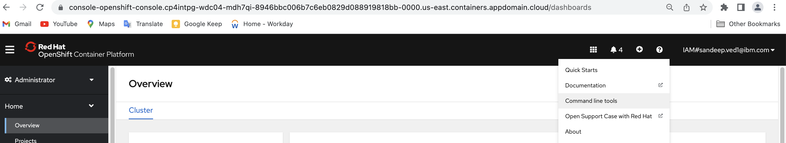

Download OC Client for your platform

Place downloaded oc binary file (oc or oc.exe )to the path in variable for your platform. See the below URL for more details.

https://docs.openshift.com/container-platform/4.8/cli_reference/openshift_cli/getting-started-cli.html 

**Mailtrap SMTP Setup**

Signup for a SMTP account on mailtrap.io. Once logged in, note down your
SMTP connection settings. For Example,

Host: smtp.mailtrap.io

Port: 2525

User: 2ef08bdc18285b

Password: 11xxxxxx06b8da

You can also check all your emails under MyInbox in mailtrap web site.

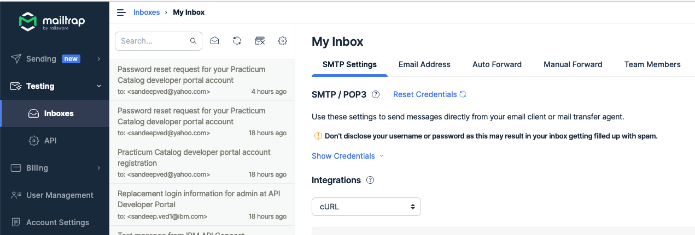

**Messaging Queue (MQ)**

**Create Queue Manager**

Go to IBM Cloud Pak home. Check the IBM Cloud PAK URL from Openshift
Routes.

Login to IBM Cloud Pak using the IBM provided credentials (admin only).

Use IBM provided Authentication (admin only) and logged in with admin /
32 char password that we gave while installing CP4I.

Go to IBM Cloud Pak Home, click on **Messaging** as highlighted in the
screen below:

This will redirect to a Messaging screen as below. Click on Create an
instance to create a queue manager.

Select **Quick start** option from this screen, and click on Next.

Modify the details for your queue manager as below:

-   **License acceptance** – Toggle the button from OFF to ON state 

-   Select **Type of availability** from dropdown as SingleInstance

-   Select **Type of Volume** from the drop down as persistent-claim 

Lastly click on **Create** from the top right corner and queue manager
will be created. You will be redirected to a new page, showing the
details of your newly created Queue manager.

Click on queue name --\> It should open up MQ Console

Click on manage --\> quickstart to open queue manager

**Create Queue**

Click on Create icon to create the queue.

Select a Local Queue.

Provide the details of the queue and click **create**.

Queue will be created shortly.

**Configure Default
Channel Security**

Copy Login Commands to login to oc client.

Login to Openshift cluster using oc client.

oc
login --token=sha256\~WT3FGc2jTkW0gM539MizrLUT-D7sm8RMmP4tTgKRF-g --server=https://c111-e.us-east.containers.cloud.ibm.com:30273

run below command to see all your projects.

oc projects

Run below command to switch to your project.

oc project \<projectname\>

Run below command to see the pod name of the mq queue manager.

oc get pods \| grep -i mq

Run the sample given script to configure the mq security. Make sure that
you have execution permission on the samples scripts loadmq.sh and
mq_ace_lab.mqsc.

./loadmq.sh mq-quickstart-cp4i-ibm-mq-0

This script performs:

-   Disable Chlauth security

-   Disable clientauth security

-   Disable user security on MQ objects level

**Integration Dashboard**

Navigate to Administration -\> Integration Instances.

Click on the hamburger on top left --\> click Integration Instances

Click “Create Instance” on top right of the page

Select Integration Dashboard and click next

Select either Production or Quick Start --\> click next

Key-in the details of the environment and proceed to create the
dashboard.

Upon successful creation of Integration Dashboard below message will
appear on the browser.

**Integration - ACE to
MQ**

Integration has the following components:

-   [<u>Prepare</u>](#_Toc105518930)

-   [<u>Build</u>](#_Toc105518931)

-   [<u>Deploy</u>](#_Toc105518932)

**Prepare - Asset into
IBM ACE Toolkit**

Open IBM ACE Toolkit under a workspace and create a REST API project.

Give it a name and select the specification as Swagger 2.0 Click Finish.

Open the REST API Description. Under Resources, Click on + icon to
create a resource.

Enter the resource path and select the operation as post. Click Apply.

A New resource will be created.

Click on the subflow icon or this new resource.

New subflow editor will open. Drag the IBM MQ Connector from the
transformation section in the left toolbox.

Connect the Boxes together.

Find the MQ Queue Manager Service IP address from the “openshift
console” or oc client (oc get svc \| grep -i mq).

Note the default System Server Connection Channel name
(SYSTEM.DEF.SVRCONN).

Click on the MQ Output and configure the MQ Details. Enter the Queue
Name.

Enter the MQ Connection Details like Queue Manager Name, Queue Manager
Host Name (Service IP), Listener Port no (1414 Default), Connection
Channel Name (default – SYSTEM.DEF.SVRCONN).

**Build – BAR File**

Add a new BAR file in the project to package and export the
configuration.

Enter the bar file details and click Finish.

Include the newly created project. Add the Build options and Click Save.

Rebuild BAR and save file one more time.

Check the properties of the generated bar file.

Copy the bar file path or open it in finder window.

**Deploy - Create a local
integration server**

Proceed further to create a Local Integration Server in ACE. You may do
so by using the navigation -

Right click on the Integration Servers --\> Select **Create a local
Integration Server**

Click Create a Server and Chose a Quick Start Plan. Click Next.

Drag and Drop the newly generated bar file here. Click Next.

Click Next.

Enter the Integration Server Name, Select License. Click Create.

The Integration Server will be created and ready shortly. You may
refresh the page to check on the readiness status update.

Click on the Server once its ready.

Click on the API.

Click on the <u>post/AccountEnquiry.</u>

Click on Try It Tab to test the Rest Interface.

Click on Generate to generate a random test message. Click Send.

The response should come successfully.

This completes the creation and testing of local integration server.

**API Connect (APIC)**

Navigate to Administration -\> Integration Instances.

Create an instance of the API Connect (API Management) .

Chose the basic one node plan. Click Next.

Enter the API instance Name and accept the license. Enter the license
ID.

Optionally select the matching Storage Class. Click Finish.

API Connect Instances will be created.

-   **API Managed Enterprise Gateway** is the data power gateway.

-   **API Management** is the instance where we can configure/Develop
    new APIs Products and catalog. (API Manager).

-   **API Management Administration** is where we can create
    organization, configure authentication settings, SMTP settings etc .

**Cloud Manager (API
Management Administration)**

#### Create Organization

Click on the API Management Administration Link to open Cloud Manager
Console.

Click Manage Organization.

Click on Add to create an API organization which is like a logical
separation of multiple API users.

Enter the Organization Name.

Change the User Registry to Common Services User Registry. Enter the
existing user name as admin. Click Create.

#### Configure SMTP for notifications

Click on Resource’s link in the left pane.

Click on Notification Link.

Add a new smtp server for email notifications. You can add any smtp
provider eg. Sendgrid or mailtrap or any other.

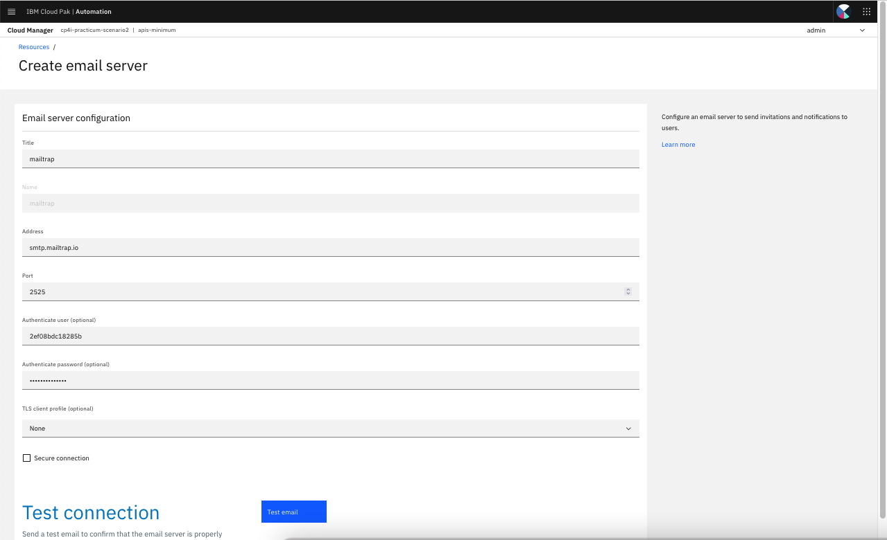

Click test email to test the connection. Enter the recipient email id
and click Send Test Email.

The email should be sent successfully.

Click Save to save the config.

Also update the same email smtp settings for the Dummy mail server as
well.

#### Configure admin email id

In the Cloud Manager, Under Manage Organization, Go to Logged in User
(admin) Settings and click My Account.

Update the email id for the current account. Very Important. Otherwise
later you will not be able to create a portal service under a catalog.

**API Manager (API
Management)**

Click on the API Management Link to open API Management Console. If you
see below picture then your Organization is not set correctly.

After setting the organization correctly, the API Manager should look
like this.

#### Develop API

Click on Develop APIs and products. Create a new API. This will
encapsulate the API created on the ACE.

Lets chose the basic one (default) with no validation. Click Next.

Provide the details for Target service.

Note the Target Service URL from Integration Dashboard that we created
earlier.

<http://is-01-toolkit-http-cp4i-practicum-scenario2.cp4intpg-wdc04-mdh7qi-8946bbc006b7c6eb0829d088919818bb-0000.us-east.containers.appdomain.cloud/myequiry/v1/AccountEnquiry>

Enter the title of the API. This will also create an endpoint / base
path using which the API can be called and it will just redirect the
request to Target Service URL.

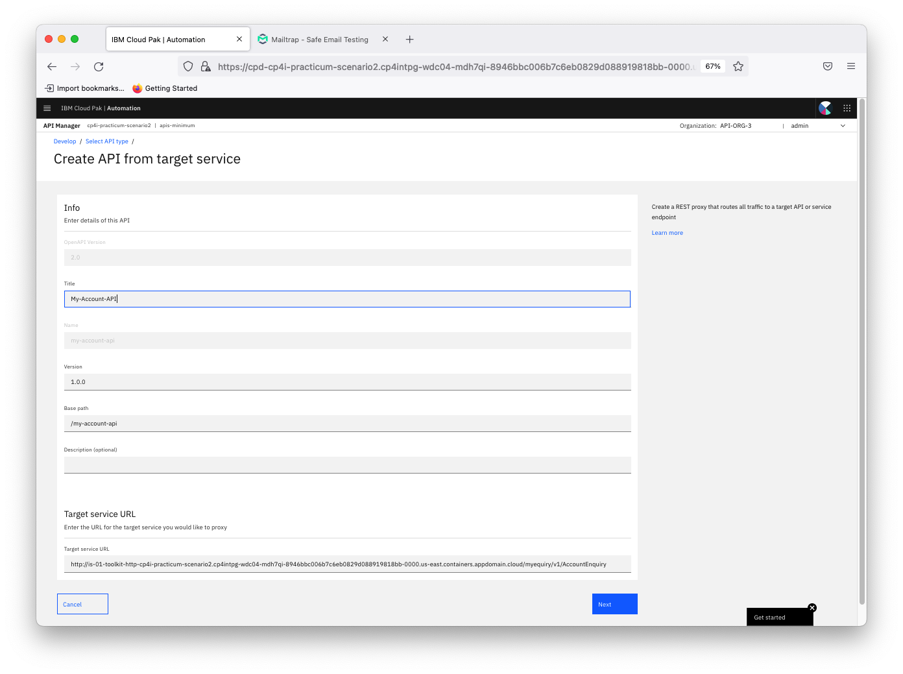

Click Next.

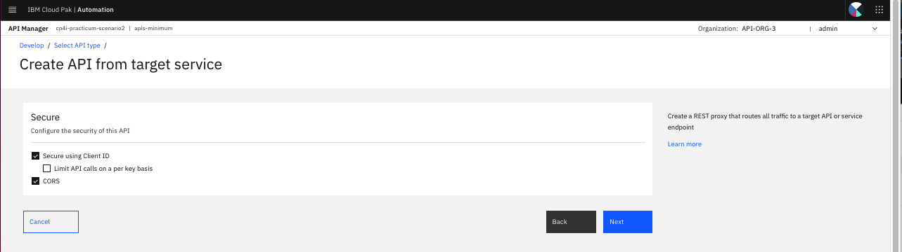

Click Edit API.

#### Configure API

After Clicking Edit API, API Design Screen will open.

As we are exposing only post service in the backend we can delete the
other operations from here.

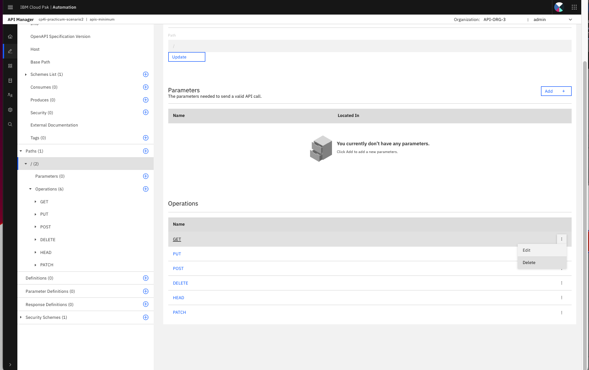

Click Save.

Under Security Schema Click Add to add another security schema.

Select apiKey as the security definition key.

Enter the details as below.

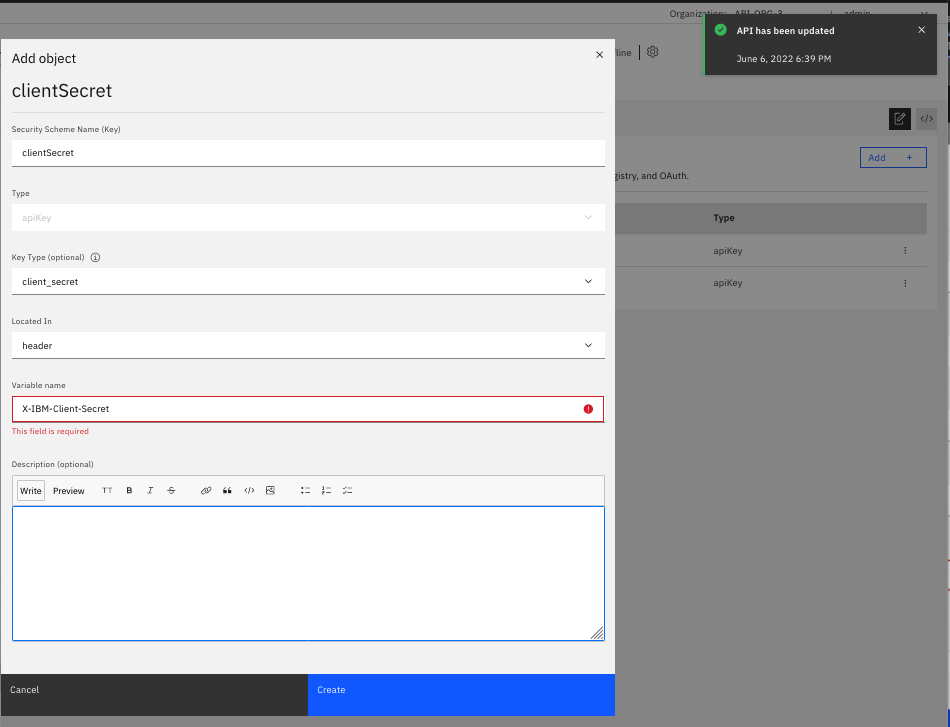

Client Secret is added as security schema. Click Save.

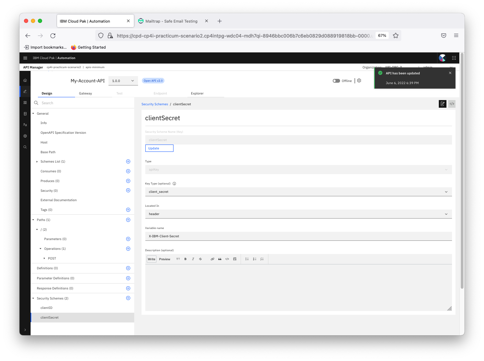

Go to General -\> Security . Edit the security schema name.

Select both parameter and Click Submit.

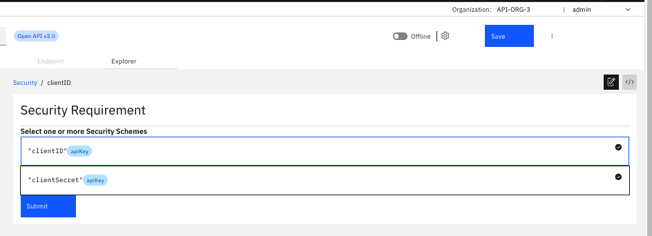

Click Save.

Now make this API online so that it will be published in a development
sandbox.

#### Develop Product

Go to Home again and develop API and Products.

Now we need to package this API into a product. One product can have
multiple APIs.

Click Add -\> Product.

Click Next.

Give a product Name. Click Next.

Select an API to be added into this product. Click Next.

Review the plan details. You can more plans by clicking on Add Button.
Can define the new plan name and rate limit (eg. API Calls Frequency).

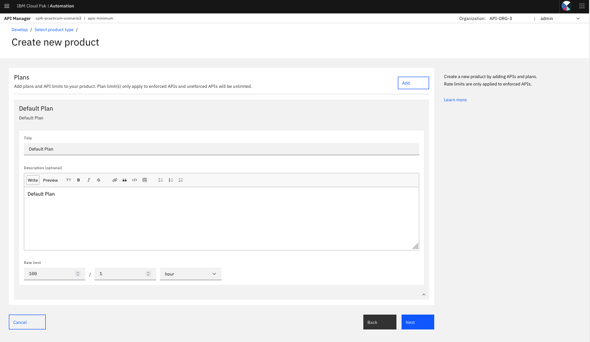

Click Next After adding the required plans.

Click Next with default options.

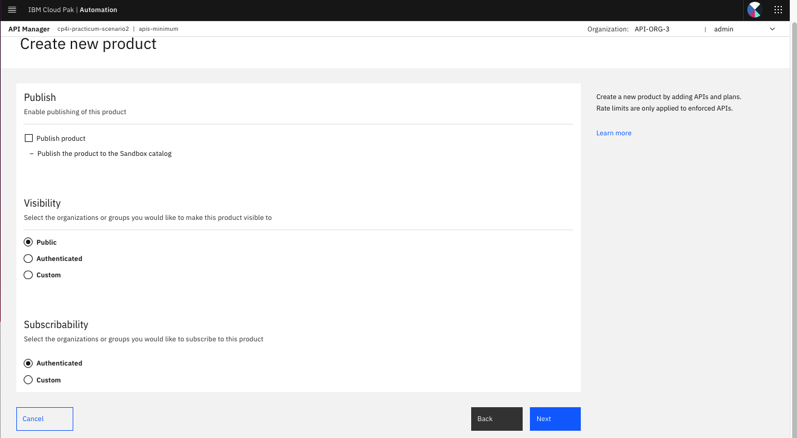

Click Done. We will publish it separately later after creating catalog.

New product is added with the new API.

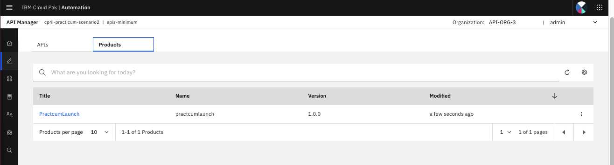

Go to API Manager Manage Settings to update the email Notification
settings.

Go to Notifications.

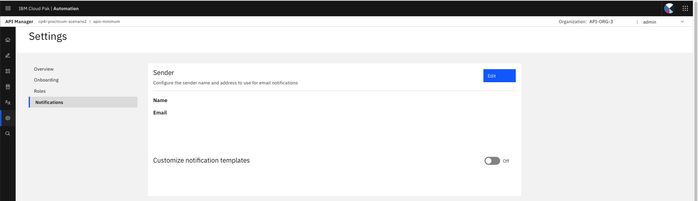

Configure the sender name and email address.

#### Create Catalog

Now we can create a catalog. One catalog can contain one developer
portal where this product can be published. We can have a internal and
external catalog where internal catalog is for internal organization and
external is for external users.

Go to manage catalogs under API Manager.

Create new Catalog.

Enter a name and Click Create

Open the new Catalog and navigate to Catalog settings.

Create a developer portal here.

Click Create. If the email if is not updated for the logged in user
account, then there will be an error mentioning so. Update the admin
user email id from Cloud Manager -\> My Account as explained earlier.
Also make sure smtp settings are correct under Cloud Manager
notification settings.

It will take a few minutes for the portal service to be ready. You will
receive an email once its ready to set the password for the portal admin
account.

#### Publish Product

Now lets publish the product to the new catalog from API Manager first.
So it can be visible in this catalog.

Select the new catalog. You can set the catalog visibility to
Authenticated users. Click Publish. It will be published shortly.

#### API Connect Developer Portal

(optional) Once you receive the email to set the password click on that
link and set the password for the admin account for API Manager.

Note down the Portal API URL from **Catalog Settings -\> Portal** and
open it in Mozilla Browser. Eg.

<https://apis-minim-27578f6b-portal-web-cp4i-practicum-scenario2.cp4intpg-wdc04-mdh7qi-8946bbc006b7c6eb0829d088919818bb-0000.us-east.containers.appdomain.cloud/api-org-3/practicum-catalog>

**Note:** Use **Mozilla Browser** only for this as there will be issues
with chrome browser with default self-signed certificate settings and
chrome will prevent the connection.

Click on **Create Account** to create a new account.

You will receive email with activation instructions.

The account will be activated and you will be able to login with the
newid. Sign in with the new id and password.

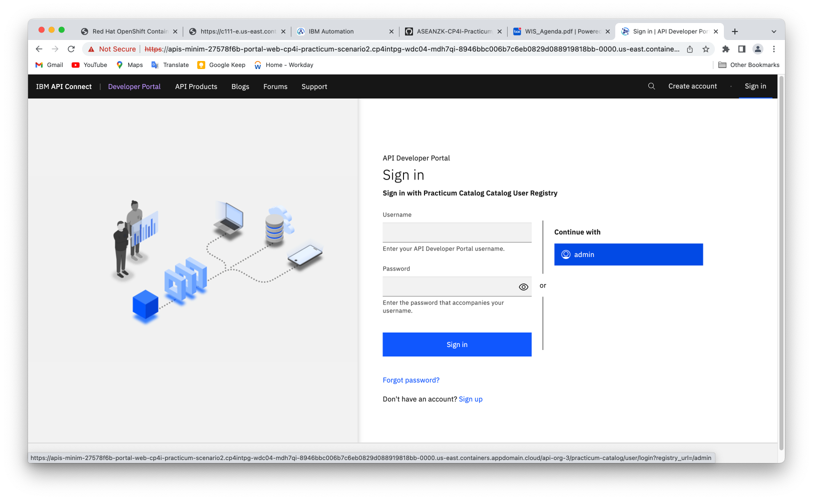

Click on Create a new App.

Enter an application Name and click Save.

Once application created successfully, note down the Key and Secret for
this application. You can not see the Key and Secret for this
application after this page. Each application will interact with API
Manager/ACE using this client secret. Click OK.

-   Key: 81b789b18XXXXXXXXXX069ec1757beb9

-   Secret: 0a38029dXXXXXXXXXXa16f47aa943eb

You can optionally click on verify link to verify your secret against
this application’s key.

Click on **Why not browse the available APIs** to subscribe to API
Product for this App.

Click on the published API product.

Just click on the **Select** button for one of the plan exposed by the
product.

Select the **application** to be subscribed.

To confirm subscription, click Next.

Click Done.

Click on **POST /** option under overview, in the left pane.

Click on **Try It** tab to test this API product.

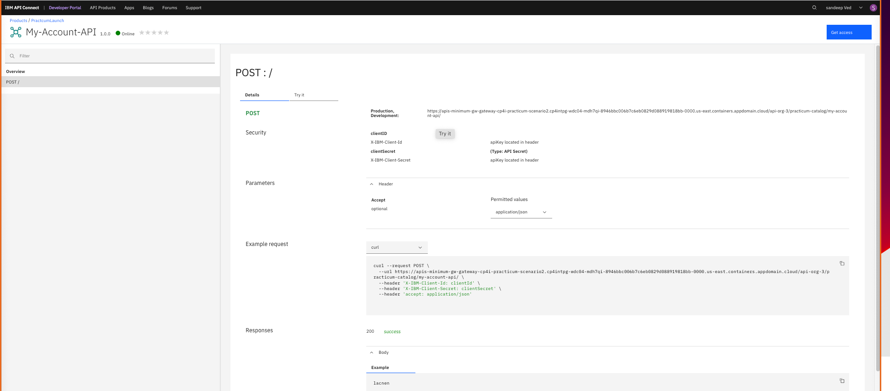

Enter the API Secret for authentication and click Send.

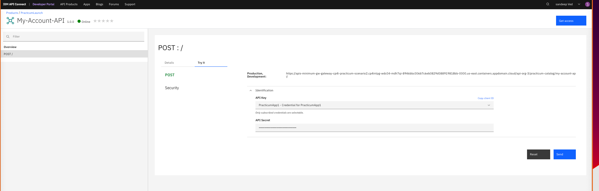

If you receive an error like below, then it could be because you are
using any other browser than Firefox. Or the Certificate is not trusted.

Open this URL in the error below in the browser and accept the
certificate. Ignore the error.

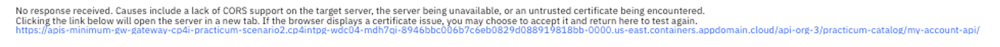

Now You can try to send the API call one more time, you should be able
to see the response successfully.

Check in the IBM MQ if this message has been stored in Queue
Successfully. Go to Integration Instances -\> Messaging instance Name
-\> Manage -\> Queue name

[Go to Configuration Index](#ibm-cloud-pak-for-integration---configuration)

[Go back to -> Table of Contents](../README.md)

[Go to next topic -> Conclusion](../Conclusion/README.md)