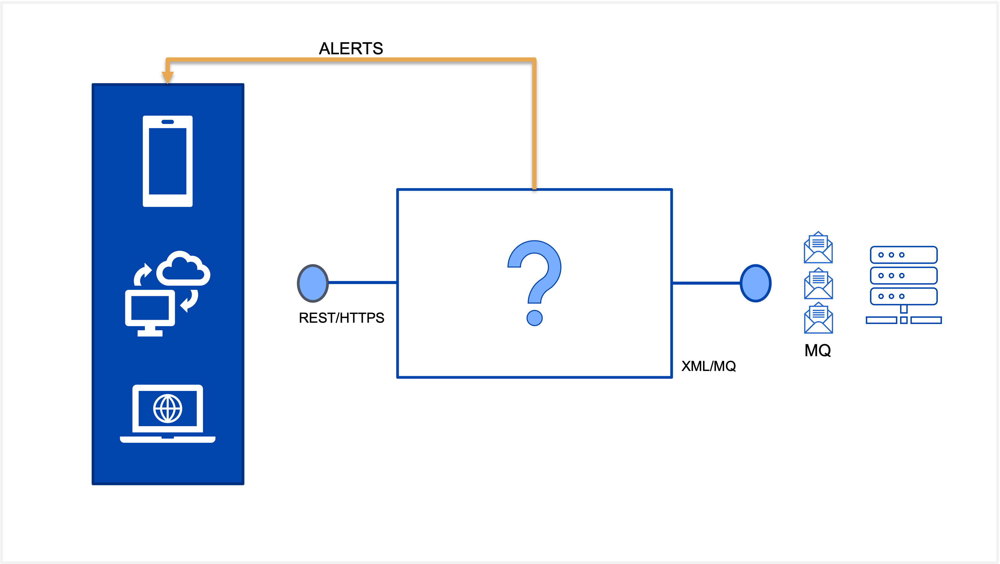

# Scenario Details

### [Topic 1.1: Introduction](README.md#introduction)
### [Topic 1.2: Requirement](README.md#requirement)
### [Topic 1.3: Challenge and Approach](README.md#challenge-and-approach)

## Introduction

- The XYZ Bank still has a core banking system running on IBM System Z. Currently the only way to integrate with this system is via MQ.

- The core banking system provides typical account functions such as query balance, deposit and withdraw. 

- The Bank has initiated a digital transformation program to modernize their channel applications such as Internet  Banking, using reactive technology to make it more user friendly and compelling to their customers.

- They want to user APIs in order to  quickly unlock their assets in the legacy systems - so that their channel applications can consume.

- Security is paramount, they need to ensure that the APIs exposed needs to be secured using client id/secret and OAuth/OIDC.

## Requirement

- Architect and build a solution that enable the customer to expose their digital assets via APIs using Cloud Pak for Integration.

- Each transaction should trigger events that can be audited or based on business rules trigger alerts.

## Challenge and Approach

Your team has five days to document your approach to a Solution to the customers business problem using CP4I capabilities and any external capabilities that you think are necessary or useful.

**Day 5**: Demonstrate your solution to whole class

[Go back to -> Table of Contents](../README.md)

[Go to next topic -> Introduction](../Introduction/README.md)