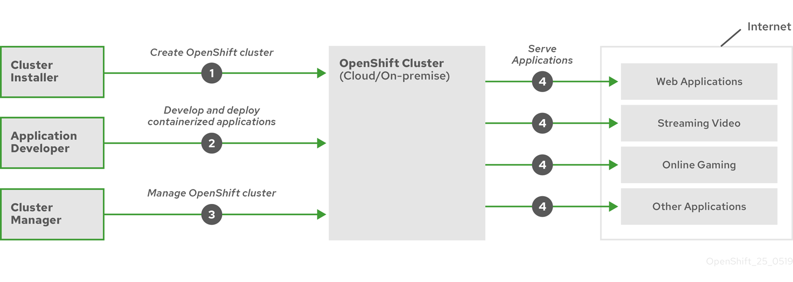

IBM CP4I Practicum Lab Book for Scenario 3:
=================
This Practicum Lab Book explains and focuses on the solution preparation and implementation for Practicum Scenario 3 using Cloud Pak for Integration (CP4I). The book will cover the solution architecture and the details of how to best implement the solution for the given scenario. This will help accelerate adoption of Cloud Pak for Integration.

Table of contents
=================

<!--ts-->
   * [Topic 1: Introduction and Scenario Details](#topic-1-introduction-and-scenario-details)
   * [Topic 2: Introduction to Clusters and Openshift](#topic-2-introduction-to-clusters-and-openshift)
   * [Topic 3: Solution Architecture](#topic-3-solution-architecture)
   * [Topic 4: Running Transformation Advisor](#topic-4-running-transformation-advisor)
   * [Topic 5: Environment Configuration](#topic-5-environment-configuration)
      * [Creating MQ Queue Manager](#creating-mq-queue-manager)
   * [Topic 6: Refactor, Build and Deployment](#topic-6--refactor-build-and-deployment)
      * [Importing Asset into IBM ACE Toolkit and creating local integration server](#importing-asset-into-ibm-ace-toolkit-and-creating-local-integration-server)
      * [Refactor ACE REST to REST Message flow](#refactor-ace-rest-to-rest-message-flow)
      * [Refactor ACE MQ Message flow using MQ Client Connection](#refactor-ace-mq-message-flow-using-mq-client-connection)
   * [Topic 7: Conclusion](#topic-7-conclusion)
<!--te-->

&nbsp;
&nbsp;
&nbsp;
&nbsp;
&nbsp;
&nbsp;
# Topic 1: Introduction and Scenario Details
Your customer has been a long-time user of **App Connect (IIB/WMB)** and **MQ**. They have recently decided to investigate the value of modernizing their integration. They would like you to use one of their existing flows and queue definitions to explore how to move to containerized integration.


While eager to understand the modernization journey, they also have reservations on their ability to scale and manage the workload.  Demonstrate how to analyze, componentize, and containerize existing integration artefacts, and illustrate how to scale and monitor the new deployments.


**Your Challenge**

Your team have (3) days to document your approach to a Solution to the customer’s business problem using CP4I capabilities and any external capabilities that you think are necessary or useful.
Demonstrate your practical solution to whole class.

Day 3: Demonstrate your practical solution to whole class.

[Back to Top](#topic-1-introduction-and-scenario-details)

&nbsp;
&nbsp;
&nbsp;
&nbsp;
&nbsp;
&nbsp;


# Topic 2: Introduction to Clusters and Openshift

## Clusters and Openshift

### Introduction to Cluster

If you're completely new to the concept of clusters, do follow the quick and easy tutorial [here](https://cloud.ibm.com/docs/openshift?topic=openshift-openshift_tutorial) to learn more
> With Red Hat® OpenShift® on IBM Cloud®, you can create highly available clusters with virtual or bare metal worker nodes that come installed with the Red Hat OpenShift on IBM Cloud Container Platform orchestration software. You get all the advantages of a managed offering for your cluster infrastructure environment, while using the Red Hat OpenShift tooling and catalog that runs on Red Hat Enterprise Linux for your app deployments.


### Introduction to Openshift

OpenShift is a platform that allows you to run containerized applications and workloads and is powered by Kubernetes. It is an offering that comes with Red Hat support, regardless of where you choose to run your applications and workloads. 

One of the big advantages of OpenShift is being able to take advantage of public and private resources which includes bare metal or virtualized hardware whether it is on-premise or on a cloud provider. 



This is the high level OpenShift Container Platform overview.

For developers, OpenShift has two different ways of enabling them to work with their platform. They can take advantage of either the CLI or a web console. 

[Back to Top](#topic-1-introduction-and-scenario-details)

&nbsp;
&nbsp;
&nbsp;
&nbsp;
&nbsp;
&nbsp;


# Topic 3: Solution Architecture
Below describe the high-level solution architecture for a simple scenario 3 solution.
By using IBM IIB/ACE transformation advisor's TADataCollector, we can analyse the current monolithic IIB/ACE application. A report will be generated to recommend what are needed to refactor, in order to achieve a microservice architecture build.

The refactor code can later be deployed in a microservices architecture on Redhat Openshift with CP4I (ACE + MQ) environment 


[Back to Top](#topic-1-introduction-and-scenario-details)

&nbsp;
&nbsp;
&nbsp;
&nbsp;
&nbsp;
&nbsp;

# Topic 4: Running Transformation Advisor

If you are planning to move your traditional integration workload (IIB/ACE) to a containerized environment, the Transformation Advisor tool helps you to analyze your on-premises workloads for modernization. You can collect and assess data for a specific integration server in an integration node backup in App Connect Enterprise by using the TADataCollector command. See [here](https://www.ibm.com/docs/en/app-connect/12.0?topic=tasks-running-transformation-advisor-tool) for more details.

## Running Transformation Advisor (TADataCollector)

If you dont have the ACE client installed, **[install client tools](Install-Client-Tools.md)** to work on this lab. 

1. Open the Integration Console (IBM App connect Enterprise Toolkit -> Open Integration console)


2. IBM ACE console will launch on your screen as below:


3. Run the Transformation Advisor by running `TADataCollector` on this console and passing Scenario3 IIB Asset [IIBV10_Broker_backup.zip](../scenario3/IIBV10_Broker_backup.zip) file through command line, as shown below: 

```
TADataCollector ace run /<path_to_assets_on_local_machine>/IIBV10_Broker_backup.zip
```

4. Once the `TADataCollector` command runs successfully, it will generate recommendation files under `/tmp/TADataCollector/output/IIB1` folder. Open the following directory to access the generated files


5.	Open the recommendations.html file located in `/tmp/TADataCollector/output/IIB1` folder & Read the recommendations made by IBM Transformation Advisor


&nbsp;
&nbsp;


[Back to Top](#topic-1-introduction-and-scenario-details)

&nbsp;
&nbsp;
&nbsp;
&nbsp;
&nbsp;

# Topic 5: Environment Configuration

Prepare the environment first as below for the new integration code deployment.

&nbsp;
<!-- ## Creating Integration Dashboard

1. Go to IBM Cloud Pak home and click on the hamburger on top left -- > click Integration Instances 


 
2. Click “Create Instance” on top left of the page


 
3. Select Integration Dashboard and click next


 
***If it is greyed out, you will need to install operator named "IBM App Connect" in openshift -> operatorHub ***

4. Select either Production or Quick Start -- > click next


 
5. Key-in the details of the environment and proceed to create the dashboard.


 
6. Upon successful creation of Integration Dashboard below message will appear on the browser. 


[Back to Top](#topic-1-introduction-and-scenario-details)

&nbsp; -->

## Creating MQ Queue Manager

1. Go to IBM Cloud Pak Home, click on “Messaging” as highlighted in the screen below


 
2. This will redirect to a Messaging screen as below. Click on Create an instance to create a queue manager.


 
3. Select “Quick start” option from this screen, and click on Next.


 
4. Modify the details for your queue manager as below:
   
   a. License acceptance – Toggle the button from OFF to ON state

   
 
   b. Select “Type of availability” from dropdown as SingleInstance  
 
   
  
 
 
   c. Select “Type of Volume” from the drop down as persistent-claim
 
  
 
 
 5. Lastly click on “Create” from the top right corner and queue manager will be created. You will be redirected to a new page, showing the details of your newly created Queue manager.
   
 

6. Click on queue manager name --> It should open up MQ Console


 
7. Click on  manage --> quickstart to open queue manager. Create two local queues by clicking on button New. Call it **IN** and **OUT**.


 
8. Navigate to Applications --> App Channel --> Click Create 


 
 
9. Click "Next" on the following page 


 
10. Select "Quick Create" and provide a Channel Name (eg. DEV_SEVRCONN), Channel Type (Server-connection) and Description. Once complete, click "Create"


 
11. On successful creation, channel will appear under "App Channels". 

12. To edit the configuration of the Channel click "Configuration" as highlighted below - 


<!-- img src="images/EditConfigChnl.png" -->
 
13. It will redirect to open the configurations section of the Channel. Under "Properties" select "SSL". Click Edit Button.


 
 
14. Select "SSL Authentication" to "Optional" and hit "Save"


 
 
 Your environment is **ready!!!**
 
 [Back to Top](#topic-1-introduction-and-scenario-details)
 
&nbsp;
&nbsp;
&nbsp;
&nbsp;
&nbsp;
&nbsp; 
# Topic 6 : Refactor, Build and Deployment

By using IBM IIB/ACE transformation advisor's TADataCollector, we have analysed the current monolith IIB/ACE application. By following the generated report, we have made the required changes to refactor the current code, in order to achieve a microservice architecture build. Sample applications will be given below. Refer to [this document](Integration_Practicum_Scenario3.docx) to understand more details how to refactor the code.

Now the refactor code can be deployed in a microservices architecture on Redhat Openshift with CP4I (ACE + MQ) environment as per below details. 

&nbsp; 
## Importing Asset into IBM ACE Toolkit and creating local integration server

1. Import the refactored project in ACE using navigation --> File -> Import -> IBM Project Interchange


2. Browse on your local machine to add the [MessageFlow_PI.zip](../scenario3/MessageFlow_PI.zip) file from the Scenario 3 assets as shown below


3. Open the assets into ACE as shown in screenshot below - 


4. Click on finish to import the Project. Your assets are successfully imported.


This will open child window to enter details of the server. Once completed, hit finish.


5. A local integration server can be created in ACE to test the application locally. You may do so by using the navigation - 
   Right click on the Integration Servers --> Select **Create a local Integration Server**
   


   Click Finish.


The new local Integration server will be created and automatically started. Alternatively, you can start it manually by right click on it and select Start.

The applications which needs to be tested on this local integration server can be deployed by right click on the integration server and select Deploy. For now proceed with following instructions to build the deployable BAR file and deploy it on CP4I integration server.


[Back to Top](#topic-1-introduction-and-scenario-details)   

&nbsp; 
## Refactor ACE REST to REST Message flow


1. Build ace message flow into BAR file for [HTTPResponseApp](int-deployment.md#build-ace-message-flow-into-bar-file) . Do for **HTTPResponseApp** only for now.

2. Deploy bar file for [HttpResponseApp flow](int-deployment.md#deploy-bar-file-to-cp4i-integration-servers) into CP4I Integration Server.  Do for **HTTPResponseApp** only for now.

3. Open ACE and navigate to HttpRequestApp —> Expand to open folder Flows —> double-click RequestService.msgflow


4. Proceed to make the following changes to each component as below:

   a. Select HttpInput on Flow Exerciser. Properties associated with it will show up at the bottom. 
	    Change the path suffix url  to /requestService
      

  
  
   b. Select HTTPRequest and replace the URL as per the cluster URL.
   
   Default WebService URL : http://localhost:7080/responseService

   Changed URL : **http://http-response-app-http-cp4i.apps.daffy-mukhc7i9.cloud.techzone.ibm.com**/responseService

   
   Before proceeding with the above change, keep the URL handy **(highlighted in bold)** by copying it from - 
   
   OCP Console --> Administrator View --> Networking --> Select Routes --> Search for the Response Integration server created. 
   Take a note of the URL in the “Location” column.
   


   Save the flow in ACE after replacing the http://localhost:7080
  

  
5. Create a BAR file for this flow and deploy it to a new Integration Server as below.

6. Build ace message flow into BAR file for [HTTPRequestApp](int-deployment.md#build-ace-message-flow-into-bar-file) . Do for **HTTPRequestApp** only for now.

7. Deploy bar file for [HTTPRequestApp flow](int-deployment.md#deploy-bar-file-to-cp4i-integration-servers) into CP4I Integration Server.  Do for **HTTPRequestApp** only for now.

## Test the deployed Request and Response Services

   a. Open Terminal on your local machine

   b. Use curl command to test your deployment 

```   
curl -v http://http-response-app-http-cp4i.apps.daffy-mukhc7i9.cloud.techzone.ibm.com/responseService
```
```
curl -v http://http-request-app-http-cp4i.apps.daffy-mukhc7i9.cloud.techzone.ibm.com/requestService
```

Please replace 
**http://http-request-app-http-cp4i.apps.daffy-mukhc7i9.cloud.techzone.ibm.com** part with the URL of your environment


    c. Receiving 200 OK on the terminal validates successful deployment

       

[Back to Top](#topic-1-introduction-and-scenario-details)

&nbsp; 
## Refactor ACE MQ Message flow using MQ Client Connection

Introduce new RestToMQApp message flow to expose putting MQ messages


1. To obtain MQ Endpoint, login to your cluster and navigate to Networking --> Services.
Search "ibm-mq" and Copy Hostname and Port as highlighted for the MQ Queue Manager that you created.


 
 
2. Navigate to ACE and open MQ Flow "RemoteMQInOt.msgflow" under MQ_Client_App.
 

 

3. On diagram at the right --> Select MQInput --> It will display properties section below.
    Navigate to MQ Connection --> It should display the properties of MQ Connection
    
    

 
 
4. Select the Connection Type as "MQ Client Connection Properties" --> Specify "Destination Queue Manager Name" , "Queue Manager Host Name" 
   (Retrieved in step - 15), "Listener Port" (Retrieved in step - 15) and "Channel Name". Hit save.


 

5. Repeat the same configuration for MQOutput


6. Build ace MQ message flow into BAR file for [MQ_Client_App](int-deployment.md#build-ace-message-flow-into-bar-file) . Do for **MQ_Client_App** only for now.

7. Deploy MQ bar file for [MQ_Client_App flow](int-deployment.md#deploy-bar-file-to-cp4i-integration-servers) into CP4I Integration Server.  Do for **MQ_Client_App** only for now.


[Back to Top](#topic-1-introduction-and-scenario-details)


## Running mq_ace_lab.mqsc

There are different layers of authorization and authentication configured on the Channel access. To simplify the exercise, we will proceed to disable to Channel security authentication and authorization using the script [mq_ace_lab.mqsc](../scenario3/mq_ace_lab.mqsc) . Below steps will assist to disable. 

**Pre-requisite**

Enable oc client for your system by following the below steps. 

1. Login to Openshift Cluster Environment. Click on the top right corner --> You Login ID will appear here --> Click copy login command


2. Browser will display "Display Token" --> Click to get your API Token
   


   
3. Copy the command captured in the previous step and use it to connect to CLI


4. Navigate to your working project example - cp4i in this example

---
oc project cp4i(your project name)

---


5. Run command as below to get the pod name of pod running MQ. Copy the pod name to be used later.

---
oc get pods|grep mq 

---


6. Change Directory to the location of your mqsc file. Use the following command to upload mqsc file to the MQ pod

---
oc exec -it **quickstart-cp4i-queue-ibm-mq-0(this is your pod’s name)** runmqsc QUICKSTART < mq_ace_lab.mqsc

---


MQ is ready and running on your environment!!!


[Back to Top](#topic-1-introduction-and-scenario-details)


&nbsp; 
    
    
# Topic 7: Conclusion  
 
 The above completes details for setup, installation and configuration of Cloud Pak for Integration for the described use case.
 As we conclude our work on the practicum, we expect you are versed with the basic fundamentals and usage of Cloud Pak for Integration.
 This will assist you in your journey to Modernizing Applications and keep upspeed with the technology and trends.
 

[Back to Top](#topic-1-introduction-and-scenario-details)